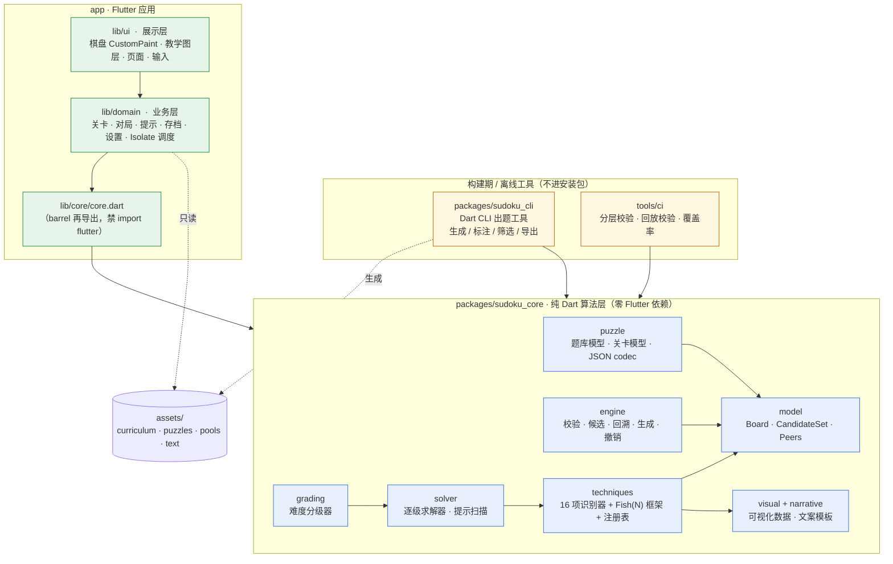
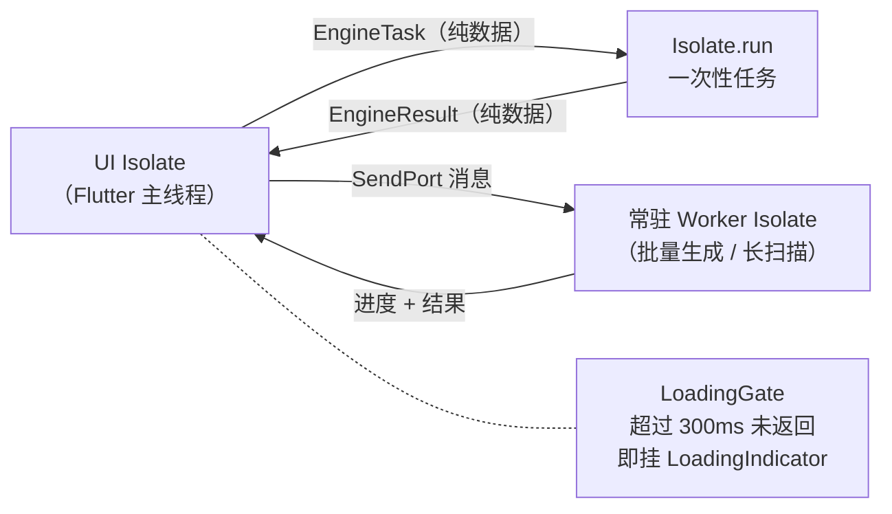
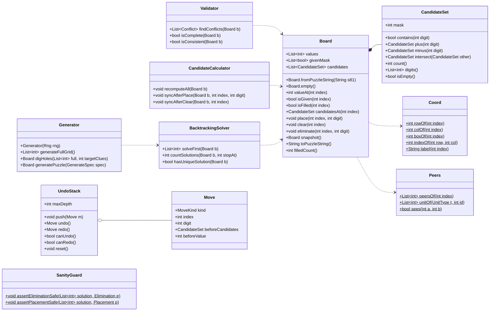
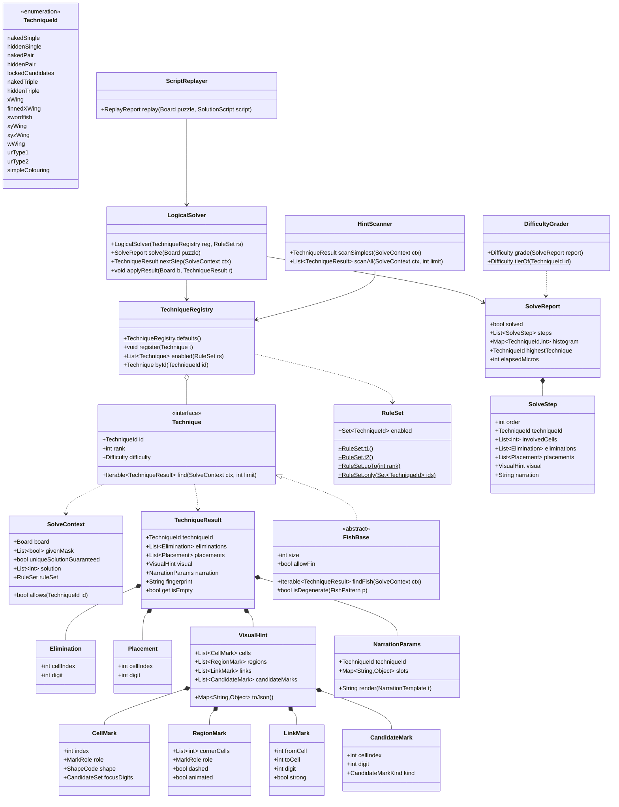
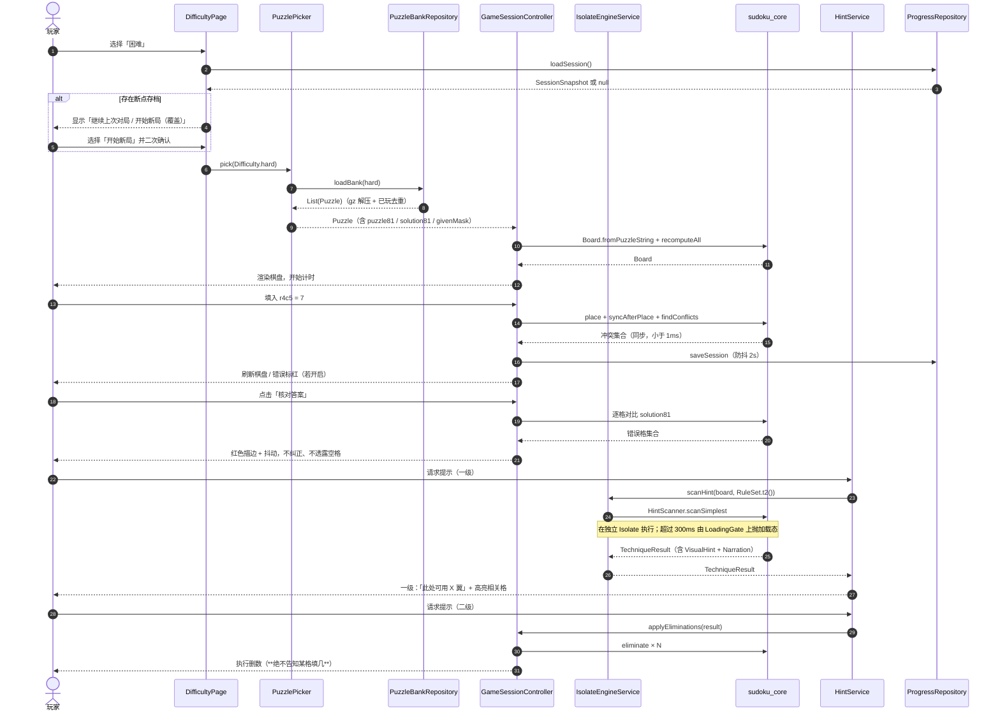
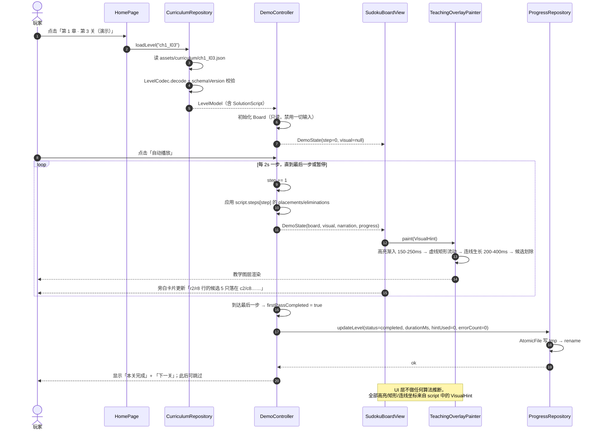
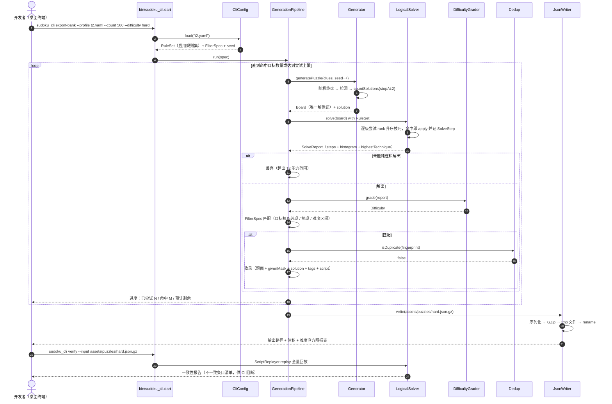
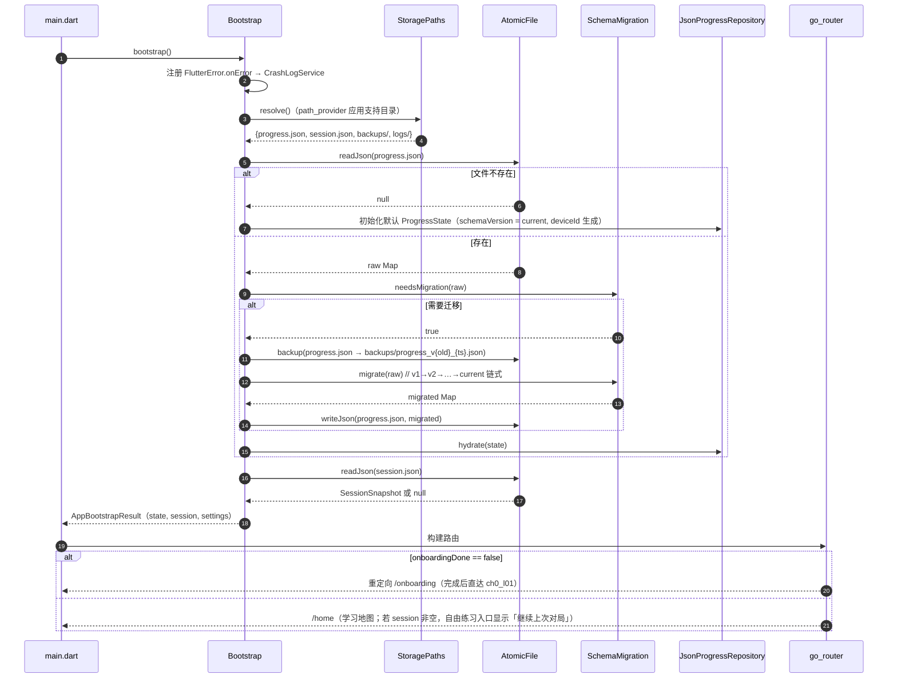
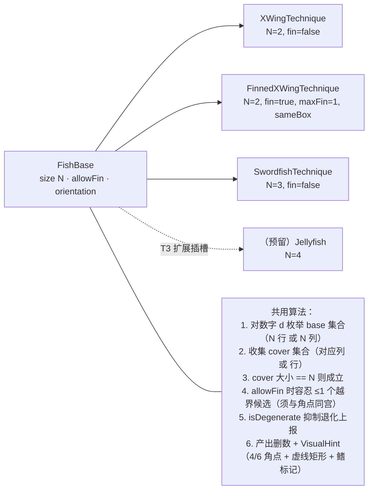

# 数独教学跨端游戏 · 系统架构设计 v1.0

> 编制：高见远（架构师）｜日期：2026-08-05
> 输入基线：doc 05《PRD 需求基线 v1.0》（全部决策已收口）、doc 03《技巧明细与分级建议表》、doc 04《环境搭建与 M0 冒烟验证》、doc 02《需求澄清清单-技术维度》、`reply.md`
> 下游使用者：寇豆码（工程师）—— 本文 + doc 07《任务分解》可直接作为编码依据
> 状态：**架构基线**。本文不再提出需求性问题；§8 仅列实现期需留意的技术风险。

---

## 0. 本文约束前提（已定死，设计不再质疑）

| # | 已确认决策 | 本文落地方式 |
|---|---|---|
| 1 | 本期平台 = Windows + Android（Android debug 签名）；macOS/iOS 仅源码适配；Web 不做 | §1.4 平台矩阵、§3 目录不含 web/ |
| 2 | 包名 `sudututor.app`；Flutter 3.x + Riverpod + **纯 JSON + path_provider**（禁数据库）+ go_router + CustomPaint | §1 选型、§4.3 存储类图 |
| 3 | 引擎与离线出题工具**统一 Dart 单一实现**，算法层独立成 package（禁 import flutter） | §2 分层、§3.1 `packages/sudoku_core` |
| 4 | 教学关**不强校验**玩家使用了某技巧 | §4.4 `TrialController` 只判"整盘解出" |
| 5 | 题目 100% 离线内置（CLI 筛选导出 JSON 进 assets） | §3.4 assets、§5.3 时序图 |
| 6 | 完全离线，无后端/无网络权限 | 依赖清单零网络库（§1.3） |
| 7 | scope = **T2**（T1 13 项 + T2 3 项 = 16 项），不含 T3 AIC；W 翼无教学章 | §6 技巧注册表 16 项 |
| 8 | P0 = 第 0+1+2+3 章（34 关）；P1 = 第 4/5 章 + 错题本/百科/回放 + macOS/iOS 源码适配 | doc 07 批次划分 |
| 9 | 质量硬门槛：行覆盖 ≥90%、**精确率 100%**、召回 ≥95%、标注集 ≥320 例、CI 分层校验、关卡 JSON 回放校验 | §7.6、doc 07 QA 任务 |
| 10 | 算法层与 UI 完全解耦；重计算入 Isolate，>300ms 显加载 | §2.3、§7.5 Isolate 协议 |

---

## 1. 实现方案与框架选型

### 1.1 核心技术难点与对策

| # | 难点 | 对策 |
|---|---|---|
| D1 | **16 项技巧识别器口径必须 100% 精确**（误删一个候选即造成死局，PRD C-14 零容忍） | 统一 `Technique` 接口 + `SolveContext` 只读上下文；所有删数结论经 `SanityGuard` 二次断言（删数不得等于终局解）；模糊测试 10,000 局兜底 |
| D2 | **算法层必须能在 Flutter App 与 Dart CLI 两处复用** | 独立 pub 包 `sudoku_core`，`pubspec.yaml` **不依赖 flutter SDK**；CI 脚本静态扫描禁 import；App 与 CLI 均通过 `path:` 依赖引入 |
| D3 | **高级技巧命中率极低**（剑鱼 0.1%–1%），运行时实时出题不可行 | 全部离线：`sudoku_cli` 桌面端长批处理 → 导出 JSON → 打包 `assets/`；App 侧只读题库 |
| D4 | **教学可视化数据不得由 UI 推断**（PRD P0-ENG-09） | `TechniqueResult` 强制携带 `VisualHint`（高亮格/矩形/连线/候选标记 + 角色 + 形状编码）；UI 层只做"数据 → 画笔"的哑渲染 |
| D5 | **UR 依赖原始题面 given 掩码**（PRD C-11） | `Board` 结构自带 `givenMask`，全链路（生成/求解/提示/回放）携带；`SolveContext.isUniqueSolutionGuaranteed` 为 UR 启用前提 |
| D6 | **低端 Android 不掉帧**（生成/评级/提示扫描是重计算） | `IsolateEngineService` 统一调度；`Isolate.run` 一次性任务 + 常驻 worker 两种模式；>300ms 自动挂加载指示 |
| D7 | **一关一 JSON、新增关卡不改代码**（PRD C-25） | `assets/curriculum/index.json` 清单驱动；`LevelCodec` 带 `schemaVersion`；CI 回放校验全量关卡 |
| D8 | **存档零数据库且必须可迁移**（PRD C-04 / C-26） | `AtomicFile`（tmp → fsync → rename）+ `SchemaMigration` 链式迁移 + 升级前自动备份 |
| D9 | **色觉异常用户可辨**（PRD P0-UI-03） | 教学高亮**颜色 + 形状**双通道编码，编码表在 `sudoku_core` 侧以 `MarkRole` 语义下发，UI 侧 `TeachingPalette` 固定映射 |

### 1.2 架构模式

| 层 | 模式 | 说明 |
|---|---|---|
| `sudoku_core` | **纯函数 + 策略模式（Technique）+ 注册表** | 无状态、可测试、可跨 Isolate、可被 CLI 复用 |
| `app/lib/domain` | **Repository + Service + Riverpod Notifier（MVVM 的 VM 层）** | 业务规则与持久化，零 Widget 依赖 |
| `app/lib/ui` | **声明式 Widget + CustomPainter 哑渲染** | 只消费 domain 暴露的 State，不含业务判断 |
| 跨层 | **单向依赖**：ui → domain → core，**core 不反向依赖任何上层** | CI 静态校验（§7.6） |

### 1.3 依赖包清单（锁定版本区间）

> 原则：**零网络运行时依赖、零运行时下载、桌面端无需分发额外 DLL**。所有版本以 `^` 约束 + `pubspec.lock` 入库双保险。

#### `packages/sudoku_core`（纯 Dart，**禁 flutter**）

| 包 | 版本约束 | 用途 |
|---|---|---|
| `meta` | `^1.15.0` | `@immutable` / `@visibleForTesting` 注解 |
| `collection` | `^1.18.0` | `ListEquality`、`UnmodifiableListView` 等 |
| dev: `test` | `^1.25.0` | 纯 Dart 单测 |
| dev: `coverage` | `^1.11.0` | 行覆盖率统计（≥90% 门槛） |
| dev: `lints` | `^5.0.0` | 纯 Dart lint 基线 |

#### `packages/sudoku_cli`（纯 Dart CLI）

| 包 | 版本约束 | 用途 |
|---|---|---|
| `sudoku_core` | `path: ../sudoku_core` | **复用同一套推理规则**（PRD C-13） |
| `args` | `^2.6.0` | 子命令与参数解析 |
| `path` | `^1.9.0` | 跨平台路径拼接 |
| `yaml` | `^3.1.2` | 出题 profile 配置（启用规则集声明） |
| dev: `test` | `^1.25.0` | 管线单测 |

#### `app`（Flutter 应用）

| 包 | 版本约束 | 用途 | 备注 |
|---|---|---|---|
| `flutter` | sdk | — | — |
| `flutter_localizations` | sdk | ARB / gen-l10n 结构预留（PRD C-17） | 本期仅 `zh_CN` |
| `sudoku_core` | `path: ../packages/sudoku_core` | 算法层 | 唯一算法来源 |
| `flutter_riverpod` | `^2.6.1` | 状态管理，**不启用 codegen** | PRD 明确 |
| `go_router` | `^14.6.0` | 声明式路由、深链预留 | — |
| `path_provider` | `^2.1.5` | 存档目录解析 | 五端一致 |
| `shared_preferences` | `^2.3.3` | 少量标量设置（首启标记、主题键） | PRD P0-STO-01 允许 |
| `file_selector` | `^1.0.3` | 桌面端存档导入/导出文件对话框 | Flutter 官方维护，无运行时下载 |
| `share_plus` | `^10.1.2` | 移动端存档导出走系统分享 | — |
| `package_info_plus` | `^8.1.1` | 设置页版本号（连点 7 次开发者模式） | — |
| `device_info_plus` | `^11.1.1` | 崩溃日志设备信息 + `deviceId` 生成 | 不上报，仅本地落盘 |
| `audioplayers` | `^6.1.0` | 极简音效（3–5 个 CC0，<300KB，**默认关**） | 经 `SoundService` 抽象，不支持平台自动降级为 no-op |
| `collection` | `^1.18.0` | 通用集合工具 | — |
| dev: `flutter_lints` | `^5.0.0` | lint 基线 + `strict-casts` / `strict-raw-types` | PRD P0-QA-07 |
| dev: `flutter_test` / `integration_test` | sdk | Widget 测试与端到端冒烟 | — |

> **明确不引入**：任何数据库（Isar / sqflite / hive）、任何网络库（dio / http）、任何埋点或崩溃 SDK、Lottie / Rive、`file_picker`（改用官方 `file_selector`，规避原生依赖）、CJK 内置字体。
> **震动**使用 Flutter 内置 `HapticFeedback`，零依赖。
> **题库压缩**使用 `dart:io` 内置 `GZipCodec`（assets 存 `.json.gz`），零依赖。

### 1.4 版本锁定与平台矩阵

**锁定方式（三处同步，缺一不可）**

```
仓库根/.fvmrc                    → { "flutter": "<verify_env 实测 stable 版本>" }
app/pubspec.yaml                 → environment: { sdk: '>=3.5.0 <4.0.0', flutter: '>=3.24.0' }
packages/sudoku_core/pubspec.yaml→ environment: { sdk: '>=3.5.0 <4.0.0' }   # 无 flutter 字段
docs/版本基线.md                  → 记录 flutter doctor -v 期望输出（PRD P0-M0-04）
```

> ⚠️ `.fvmrc` 中的具体版本号**以客户 `verify_env.ps1` 报告的实测 stable 版本为准**（doc 04 §3），写入后全团队不得漂移；`pubspec.lock`（app 与两个 package 各一份）必须入库。

| 平台 | 本期产物 | 下限 | 备注 |
|---|---|---|---|
| Windows | Release 目录 + Inno Setup `Setup.exe` + 绿色版 zip | Win10 1809 x64 | 不做代码签名 |
| Android | `app-debug.apk`（arm64-v8a + armeabi-v7a） | API 26 (8.0) | debug 签名，不上架 |
| macOS / iOS | **不出产物**，仅源码适配 + 构建说明 | — | P1 |
| Web | **不做** | — | 目录中不保留 `web/` |

---

## 2. 整体分层架构

### 2.1 分层依赖图



**依赖方向铁律**

| 规则 | 校验手段 |
|---|---|
| `sudoku_core` 不得 import `package:flutter/*`、`dart:ui`、`dart:html` | `tools/ci/check_layering.dart`（CI 失败即阻断） |
| `sudoku_core` 不得 import `sudoku_cli` / app 任何文件 | 同上（pub 包边界天然隔离） |
| `lib/ui` 不得直接 import `package:sudoku_core/*`，必须经 `lib/domain` 暴露的 ViewModel/State | 同上（白名单例外：`VisualHint` 等纯渲染数据类型，见 §7.1） |
| `lib/domain` 不得 import `package:flutter/material.dart`（可 import `foundation.dart`） | 同上 |

### 2.2 各层职责边界

| 层 | 职责 | **明确不做** |
|---|---|---|
| `sudoku_core/model` | 盘面/候选/坐标/peers 的数据表达与位运算 | 不做业务规则、不做 IO |
| `sudoku_core/engine` | 校验、候选同步、回溯求解、唯一解、生成、撤销栈 | 不做技巧推理 |
| `sudoku_core/techniques` | 16 项识别器，产出删数结论 + 可视化 + 文案参数 | **不修改盘面**（只产出结论，由调用方 apply） |
| `sudoku_core/solver` | 按 `RuleSet` 逐级求解、记录步骤、提示扫描 | 不做难度语义解释 |
| `sudoku_core/grading` | 步骤序列 → 五档难度 | 不做求解 |
| `sudoku_core/puzzle` | 题库/关卡模型与 JSON codec | 不做文件 IO（收字符串、吐字符串） |
| `app/domain` | 关卡解锁、对局状态机、提示分级、存档持久化、Isolate 调度、设置 | 不含 Widget、不含 BuildContext |
| `app/ui` | 渲染、手势、动画、路由页面 | **不推断任何算法结论**（含高亮位置） |
| `sudoku_cli` | 批量生成/标注/筛选/导出、去重、报表 | 不重写任何推理规则 |

### 2.3 运行时线程模型



| 计算 | 执行位置 | 理由 |
|---|---|---|
| 单格填数、候选增量同步、撤销/重做、合法性校验 | **UI Isolate 同步** | O(20) 级，<1ms |
| 一次唯一解校验 / 回溯求解 | Isolate.run | PC <5ms，低端安卓可达 20–50ms |
| 谜题生成（挖洞 + 唯一解保持） | Isolate.run | 可达数百 ms |
| 难度分级（全链逐级求解） | Isolate.run | 同上 |
| 提示扫描（全技巧链） | Isolate.run | 大师档可达 100–400ms |
| CLI 批处理 | 独立进程，无 Isolate 约束 | 桌面端离线跑 |

---

## 3. 目录结构与文件清单

### 3.0 仓库总体布局

```
sudoku_tutor/                        ← 仓库根（= 当前工作目录，git root）
├─ .fvmrc                            Flutter 版本锁定
├─ analysis_options.yaml             全仓 lint 基线（flutter_lints + strict-casts/raw-types）
├─ README.md
├─ app/                              Flutter 应用（flutter create 产物，目录由 sudoku_tutor/ 重命名而来）
├─ packages/
│   ├─ sudoku_core/                  纯 Dart 算法层
│   └─ sudoku_cli/                   Dart CLI 出题工具
├─ tools/
│   └─ ci/                           分层校验 / 回放校验 / 覆盖率脚本
├─ scripts/                          setup_windows.ps1 / verify_env.ps1（已有）
├─ docs/                             需求与设计文档（已有）
└─ dataset/                          标注盘面集与 CLI 中间产物（不进安装包）
```

> ⚠️ **M0 产物迁移**：doc 04 §4 用 `flutter create` 生成的目录名为 `sudoku_tutor/`，本架构将其**重命名为 `app/`** 以容纳三包结构。重命名不影响 `pubspec.yaml` 的 `name: sudoku_tutor`、Windows `BINARY_NAME=sudoku_tutor`、Android `applicationId`。**重命名后必须立即复跑 `flutter build windows` + `flutter build apk --debug` 复验**（见 doc 07 T-INF-02）。

### 3.1 `packages/sudoku_core`（纯 Dart 算法层，约 66 文件）

| 相对路径 | 职责（一句话） |
|---|---|
| `pubspec.yaml` | 包声明；**不含 flutter 依赖**，SDK 约束与 app 一致 |
| `analysis_options.yaml` | 继承根 lint，额外禁用 `dart:ui` / `package:flutter` import |
| `lib/sudoku_core.dart` | **唯一对外 barrel**，导出全部公共 API，`src/` 一律私有 |
| **model** | |
| `lib/src/model/coord.dart` | 索引 ↔ 行/列/宫换算、单元编号常量 |
| `lib/src/model/peers.dart` | 每格 20 个 peer 与 3 个所属单元的静态预计算表 |
| `lib/src/model/candidate_set.dart` | 9 位位集候选集（int 掩码）与位运算 API |
| `lib/src/model/cell.dart` | 单格视图（值 / 是否给定 / 候选集） |
| `lib/src/model/board.dart` | 9×9 盘面：`values` + `givenMask` + `candidates`，含可变/快照两形态 |
| `lib/src/model/board_codec.dart` | 81 字符串、行列文本、JSON 与 `Board` 互转 |
| `lib/src/model/unit.dart` | 单元（行/列/宫）抽象与遍历器 |
| `lib/src/model/digit.dart` | 数字 1–9 常量、字符转换 |
| **engine** | |
| `lib/src/engine/validator.dart` | 行/列/宫冲突检测与盘面完整性检测（P0-ENG-02） |
| `lib/src/engine/candidate_calculator.dart` | 候选数全量计算 + 填数/清除时的增量同步（P0-ENG-04） |
| `lib/src/engine/backtracking_solver.dart` | 回溯求解 + 解数计数（found 2 即中止）（P0-ENG-03） |
| `lib/src/engine/uniqueness_checker.dart` | 唯一解校验封装（UR 前提、导入题校验共用） |
| `lib/src/engine/generator.dart` | 随机终盘生成 + 挖洞 + 唯一解保持（P0-ENG-06） |
| `lib/src/engine/move.dart` | 一次原子操作（填数/清除/标记候选/删候选）值对象 |
| `lib/src/engine/move_applier.dart` | `Move` 的应用与逆应用（撤销依赖） |
| `lib/src/engine/undo_stack.dart` | 撤销/重做栈（深度 100）+ 重置本局（P0-ENG-05） |
| `lib/src/engine/sanity_guard.dart` | **删数结论安全断言**：任何删数不得等于终局解（P0-QA-03 底座） |
| **techniques** | |
| `lib/src/techniques/technique.dart` | `Technique` 抽象接口（`find(ctx)` → 结果流） |
| `lib/src/techniques/technique_id.dart` | 16 项技巧枚举 + **定死中文译名** + 英文名 |
| `lib/src/techniques/technique_rank.dart` | 技巧等级序（逐级求解顺序 & 难度分级依据） |
| `lib/src/techniques/technique_result.dart` | 识别结果：删数/填数 + `VisualHint` + `NarrationParams` + 指纹 |
| `lib/src/techniques/solve_context.dart` | 只读求解上下文（盘面 + givenMask + 唯一解标志 + peers 缓存） |
| `lib/src/techniques/technique_registry.dart` | 注册表：按 rank 排序、按 `RuleSet` 过滤、扩展插槽（P0-ENG-11） |
| `lib/src/techniques/rule_set.dart` | 启用规则集（T1 / T2 / 自定义子集 / 已学范围）（P0-CLI-02） |
| `lib/src/techniques/basic/naked_single.dart` | 唯一余数（P0-TEC-01） |
| `lib/src/techniques/basic/hidden_single.dart` | 隐性唯一数，行/列/宫三单元（P0-TEC-02） |
| `lib/src/techniques/basic/naked_subset.dart` | 裸对/裸三（N 泛化，N∈{2,3}）（P0-TEC-03/05） |
| `lib/src/techniques/basic/hidden_subset.dart` | 隐对/隐三（N 泛化，N∈{2,3}）（P0-TEC-04/06） |
| `lib/src/techniques/basic/locked_candidates.dart` | 区块排除：指针法 + 占位法（P0-TEC-07） |
| `lib/src/techniques/fish/fish_base.dart` | **Fish(N) 泛化框架**：base/cover 集枚举 + 退化抑制 + 鳍扩展插槽 |
| `lib/src/techniques/fish/x_wing.dart` | X 翼 = Fish(2)，行列对偶（P0-TEC-08） |
| `lib/src/techniques/fish/swordfish.dart` | 剑鱼 = Fish(3) 标准，**退化为 X 翼不上报**（P0-TEC-09） |
| `lib/src/techniques/fish/finned_x_wing.dart` | 鳍形 X 翼含 Sashimi，鳍 ≤1 且同宫（P0-TEC-14） |
| `lib/src/techniques/wing/xy_wing.dart` | XY 翼（P0-TEC-10） |
| `lib/src/techniques/wing/xyz_wing.dart` | XYZ 翼，删数格须同时看到 pivot 与两 pincer（P0-TEC-11） |
| `lib/src/techniques/wing/w_wing.dart` | W 翼，**严格共轭对强链**（P0-TEC-15） |
| `lib/src/techniques/uniqueness/ur_base.dart` | UR 矩形枚举与前提校验（2 行×2 列×恰好 2 宫、全非给定、唯一解） |
| `lib/src/techniques/uniqueness/ur_type1.dart` | 唯一矩形 型一（P0-TEC-12） |
| `lib/src/techniques/uniqueness/ur_type2.dart` | 唯一矩形 型二（P0-TEC-13） |
| `lib/src/techniques/colouring/conjugate_pair_graph.dart` | 单数字共轭对图构建（强链） |
| `lib/src/techniques/colouring/simple_colouring.dart` | 双色 BFS + **仅 Rule 2 / Rule 4**（P0-TEC-16） |
| **visual（P0-ENG-09）** | |
| `lib/src/visual/mark_role.dart` | 角色枚举：pattern / fin / cover / pivot / pincer / elimination / chainStrong / chainWeak / target |
| `lib/src/visual/shape_code.dart` | 形状编码枚举（双通道第二通道）：实线粗框/虚线框/斜纹/圆点角标/划除 |
| `lib/src/visual/cell_mark.dart` | 高亮格标记（格索引 + 角色 + 形状 + 可选候选子集） |
| `lib/src/visual/region_mark.dart` | 矩形/单元描边标记（角点坐标、是否虚线、是否流动） |
| `lib/src/visual/link_mark.dart` | 连线标记（两端格 + 强/弱链 + 可选数字） |
| `lib/src/visual/candidate_mark.dart` | 候选数标记（划除 / 强调 / 目标） |
| `lib/src/visual/visual_hint.dart` | 上述四类标记的聚合根 + JSON codec |
| **narrative（P0-ENG-10）** | |
| `lib/src/narrative/narration_params.dart` | 结构化参数（技巧、数字、行列号、格集合、删数集合） |
| `lib/src/narrative/narration_template.dart` | 模板引擎（占位符替换、单元/坐标的中文表述） |
| `lib/src/narrative/zh_cn_templates.dart` | 16 项技巧的简体中文结论句模板表 |
| **solver** | |
| `lib/src/solver/solve_step.dart` | 单步记录（技巧 / 涉及格 / 删数 / 可视化 / 旁白） |
| `lib/src/solver/solve_report.dart` | 求解报告（步骤序列 / 是否解出 / 技巧直方图 / 最高技巧） |
| `lib/src/solver/logical_solver.dart` | **逐级技巧求解器**：按 rank 逐级尝试，命中即应用并记录（P0-ENG-07） |
| `lib/src/solver/hint_scanner.dart` | 提示扫描：返回当前盘面可用的**最简**技巧结果 |
| `lib/src/solver/script_replayer.dart` | 按解题脚本回放并校验每步一致性（P0-QA-05 底座） |
| **grading** | |
| `lib/src/grading/difficulty.dart` | 五档枚举（入门/简单/中等/困难/大师）+ 中文名 |
| `lib/src/grading/difficulty_grader.dart` | 取解题过程最高级技巧 → 档位映射（P0-ENG-08） |
| **puzzle** | |
| `lib/src/puzzle/puzzle.dart` | 题目模型（题面 / givenMask / 终局解 / 技巧标签 / 难度 / 指纹） |
| `lib/src/puzzle/puzzle_codec.dart` | 题库 JSON 编解码（含分片与 schemaVersion） |
| `lib/src/puzzle/solution_script.dart` | 解题脚本（步骤序列，供演示与回放） |
| `lib/src/puzzle/level_model.dart` | **关卡模型（一关一 JSON schema）** |
| `lib/src/puzzle/level_codec.dart` | 关卡 JSON 编解码 + `schemaVersion` 校验 |
| `lib/src/puzzle/level_index.dart` | `index.json` 清单模型（章节 → 关卡列表） |
| **util** | |
| `lib/src/util/bit_ops.dart` | popcount / 位遍历 / 组合枚举 |
| `lib/src/util/rng.dart` | 可复现随机源（seed 驱动，保证 CLI 可重放） |
| `lib/src/util/fingerprint.dart` | 盘面规范化指纹（同构去重用） |
| `lib/src/util/core_error.dart` | 错误码枚举与异常类型（§7.3） |
| `lib/src/util/result.dart` | 轻量 `Ok/Err` 返回封装 |

### 3.2 `packages/sudoku_cli`（Dart CLI 出题工具，约 15 文件）

| 相对路径 | 职责 |
|---|---|
| `pubspec.yaml` | 依赖 `sudoku_core`（path）、`args`、`yaml`、`path` |
| `bin/sudoku_cli.dart` | 入口，子命令分发（P0-CLI-01） |
| `lib/src/commands/command_base.dart` | 子命令基类（通用参数：profile / seed / 并发 / 输出目录） |
| `lib/src/commands/generate_command.dart` | 批量生成盘面（唯一解保证） |
| `lib/src/commands/annotate_command.dart` | 逐级求解标注（技巧序列 + 可视化数据） |
| `lib/src/commands/filter_command.dart` | 按技巧标签 / 难度 / 已学范围筛选（P0-CLI-03） |
| `lib/src/commands/export_bank_command.dart` | 导出自由练习题库（五档 × 200–500，gz ≤1MB）（P0-CLI-05） |
| `lib/src/commands/export_pool_command.dart` | 导出综合试炼关题池（每章 ≥20）（P0-CLI-06） |
| `lib/src/commands/export_level_command.dart` | 导出教学关候选盘面供人工精选（P0-CLI-07） |
| `lib/src/commands/verify_command.dart` | 回放校验 + 精确率/召回率报表（QA 用） |
| `lib/src/pipeline/generation_pipeline.dart` | 生成 → 标注 → 筛选 → 去重 → 导出 编排 |
| `lib/src/pipeline/filter_spec.dart` | 筛选条件表达（目标技巧 / 必须出现 / 禁止出现 / 难度区间） |
| `lib/src/pipeline/dedup.dart` | 基于规范化指纹的同构去重 |
| `lib/src/io/json_writer.dart` | 分片写出 + GZip 压缩 + 原子落盘 |
| `lib/src/io/progress_reporter.dart` | 终端进度与耗时统计 |
| `lib/src/config/cli_config.dart` | YAML profile 载入（**启用规则集声明**，P0-CLI-02） |
| `lib/src/config/default_profiles.dart` | T1 / T2 与五档难度的默认 profile |

### 3.3 `app`（Flutter 应用，约 118 文件）

#### 3.3.1 装配与 core barrel

| 相对路径 | 职责 |
|---|---|
| `lib/main.dart` | 入口：`runApp` + 全局错误捕获 |
| `lib/app/bootstrap.dart` | 启动初始化（存档载入/迁移、设置注入、资产预热、崩溃钩子） |
| `lib/app/app.dart` | `MaterialApp.router` 装配（主题 / 本地化 / 字号钳制） |
| `lib/app/router.dart` | go_router 路由表（含首启引导重定向、开发者模式守卫） |
| `lib/app/route_paths.dart` | 路由常量 |
| `lib/app/providers.dart` | 根 Provider 与 override（测试可替换 Repository） |
| `lib/core/core.dart` | **barrel：`export 'package:sudoku_core/sudoku_core.dart';`**，保持 PRD P0-QA-04「`lib/core/` 禁 import flutter」口径成立 |

#### 3.3.2 domain 业务层

| 相对路径 | 职责 |
|---|---|
| **engine 调度** | |
| `lib/domain/engine/engine_facade.dart` | domain 访问 `sudoku_core` 的**唯一入口**（同步轻量 API） |
| `lib/domain/engine/engine_task.dart` | 跨 Isolate 任务/结果消息定义（纯数据，禁闭包） |
| `lib/domain/engine/isolate_engine_service.dart` | Isolate 调度（一次性 + 常驻 worker）、取消、超时（P0-ENG-12） |
| `lib/domain/engine/loading_gate.dart` | >300ms 自动上抛加载态 |
| `lib/domain/engine/engine_providers.dart` | 引擎相关 Provider |
| **curriculum 课程** | |
| `lib/domain/curriculum/curriculum_repository.dart` | 读 `assets/curriculum/index.json` 与单关 JSON（P0-EDU-01） |
| `lib/domain/curriculum/chapter_model.dart` | 章节视图模型（技巧标签、进度、锁状态） |
| `lib/domain/curriculum/unlock_service.dart` | 自由选关规则（索引内全部章节/关卡始终可进入，P0-EDU-08） |
| `lib/domain/curriculum/level_completion_service.dart` | 三态判定 + `stars`/`hintUsed`/`errorCount`/`durationMs` 采集（P0-EDU-09） |
| `lib/domain/curriculum/curriculum_providers.dart` | 课程 Provider |
| **puzzle_bank 题库** | |
| `lib/domain/puzzle_bank/puzzle_bank_repository.dart` | 读 `assets/puzzles/*.json.gz` 与 `assets/pools/*` |
| `lib/domain/puzzle_bank/puzzle_picker.dart` | 五档选题 / 试炼池随机抽取 / 已玩去重 |
| `lib/domain/puzzle_bank/runtime_generator_service.dart` | 入门/简单/中等档 Isolate 内补充生成（P0-PRA-01） |
| `lib/domain/puzzle_bank/puzzle_import_service.dart` | 81 字符串 + 剪贴板导入，格式与唯一解校验（P0-PRA-10） |
| **session 对局** | |
| `lib/domain/session/game_session.dart` | 一局不可变状态（盘面 / 笔记 / 撤销栈 / 用时 / 模式开关） |
| `lib/domain/session/game_session_controller.dart` | Riverpod Notifier：选格/填数/清除/笔记/撤销/重做/重置 |
| `lib/domain/session/session_rules.dart` | 自动候选数与手动笔记互斥、错误标红、相同数字高亮两级（P0-PRA-05~07） |
| `lib/domain/session/check_answer_service.dart` | 一键核对答案（只标错，不纠正、不透露）（P0-PRA-03） |
| `lib/domain/session/timer_service.dart` | 计时 / 失焦自动暂停 / 手动暂停（P0-PRA-08） |
| `lib/domain/session/session_serializer.dart` | 断点存档序列化 / 反序列化（P0-PRA-09） |
| `lib/domain/session/session_providers.dart` | 对局 Provider |
| **hint 提示** | |
| `lib/domain/hint/hint_level.dart` | 提示级别枚举（教学三级 / 练习两级） |
| `lib/domain/hint/hint_service.dart` | 逐级解锁、次数上限、结果缓存（P0-EDU-04 / P0-PRA-04） |
| `lib/domain/hint/hint_state.dart` | 已解锁级别、当前 `TechniqueResult`、可视化数据 |
| **teaching 教学** | |
| `lib/domain/teaching/demo_controller.dart` | 原理演示步进：手动/自动播放 2s、上一步、重播、技巧节点跳转、首次必看完（P0-EDU-02） |
| `lib/domain/teaching/practice_controller.dart` | 引导实操：自由操作 + 三级提示 + 目标技巧态跟踪（P0-EDU-04） |
| `lib/domain/teaching/trial_controller.dart` | 验收试炼：提示禁用、**只判整盘解出**、连败 3 次引导（P0-EDU-06/07） |
| `lib/domain/teaching/mistake_detector.dart` | 三类误操作触发判定 + 2 分钟去重（P0-EDU-05） |
| `lib/domain/teaching/mistake_message_repository.dart` | 读 `assets/text/mistakes_zh.json`（20–30 条文案） |
| `lib/domain/teaching/replay_recorder.dart` | 教学关操作序列记录（P0 采集，P1 回放消费） |
| `lib/domain/teaching/teaching_providers.dart` | 教学 Provider |
| **storage 存档** | |
| `lib/domain/storage/progress_repository.dart` | **抽象接口**，实现可替换（P0-STO-02） |
| `lib/domain/storage/json_progress_repository.dart` | 纯 JSON 实现 |
| `lib/domain/storage/atomic_file.dart` | 原子写（tmp → flush → rename）+ 读失败回滚（P0-STO-01） |
| `lib/domain/storage/storage_paths.dart` | `path_provider` 目录解析与文件名常量 |
| `lib/domain/storage/schema_migration.dart` | `schemaVersion` 逐版本迁移链 + 升级前备份（P0-STO-04） |
| `lib/domain/storage/backup_service.dart` | 自动备份与轮转 |
| `lib/domain/storage/import_export_service.dart` | 存档导入/导出（桌面 file_selector / 移动 share_plus）（P0-STO-06） |
| `lib/domain/storage/crash_log_service.dart` | 崩溃日志本地落盘（最近 20 条）+ 导出（P0-STO-07） |
| `lib/domain/storage/models/progress_state.dart` | 存档根对象（schemaVersion / deviceId / userId? / profileId?） |
| `lib/domain/storage/models/level_progress.dart` | 单关进度与采集字段 |
| `lib/domain/storage/models/session_snapshot.dart` | 自由练习断点快照 |
| `lib/domain/storage/models/settings_state.dart` | 设置项（P0-STO-08 冻结清单） |
| `lib/domain/storage/models/mistake_book.dart` | 错题本数据结构（P0 只采集） |
| `lib/domain/storage/models/practice_stats.dart` | 练习统计原始数据（P0 只采集） |
| `lib/domain/storage/storage_providers.dart` | 存储 Provider |
| **settings / stats** | |
| `lib/domain/settings/settings_controller.dart` | 设置读写与副作用广播 |
| `lib/domain/settings/developer_mode.dart` | 版本号连点 7 次进入、全解锁、重置（P0-EDU-10） |
| `lib/domain/stats/stats_collector.dart` | 统计采集（P0 只写不展示） |

#### 3.3.3 ui 展示层

| 相对路径 | 职责 |
|---|---|
| **theme** | |
| `lib/ui/theme/app_theme.dart` | Material 3 主题装配（单一种子色 Indigo） |
| `lib/ui/theme/color_tokens.dart` | **白/粉/蓝三套令牌插槽**，本期仅白色实现，另两套占位（P0-UI-01/C-16） |
| `lib/ui/theme/game_palette.dart` | 经典蓝色/清新绿色棋盘主题扩展与做题语义色（P0-UI-02） |
| `lib/ui/theme/teaching_palette.dart` | 教学高亮 5 色 + **形状编码**映射表（双通道，P0-UI-03） |
| `lib/ui/theme/typography.dart` | 字体与字号阶梯（系统字体，不内置 CJK） |
| `lib/ui/theme/spacing.dart` | 间距/圆角/elevation 常量 |
| `lib/ui/theme/text_scale_clamp.dart` | 系统字号钳制在 0.85–1.3（P0-UI-07） |
| **board 棋盘** | |
| `lib/ui/board/board_geometry.dart` | 格坐标 ↔ 像素换算、候选数 3×3 微排布定位 |
| `lib/ui/board/board_view_model.dart` | 渲染数据装配（选中/弱高亮/同数高亮/错误/候选） |
| `lib/ui/board/board_painter.dart` | 蓝/绿主题棋盘语义层级 + 圆角裁切 + 三层格线 + 数字/候选数绘制（P0-UI-02） |
| `lib/ui/board/teaching_overlay_painter.dart` | 教学图层：多色高亮/虚线矩形/连线/候选划除（P0-EDU-03） |
| `lib/ui/board/sudoku_board_view.dart` | 棋盘容器（手势、焦点、语义、动画驱动） |
| `lib/ui/board/animations/highlight_fade.dart` | 高亮渐入渐出 150–250ms |
| `lib/ui/board/animations/link_grow.dart` | 连线生长 200–400ms 缓动 |
| `lib/ui/board/animations/candidate_strike.dart` | 候选数划除动画 |
| `lib/ui/board/animations/error_shake.dart` | 错误抖动（核对答案） |
| **input 输入** | |
| `lib/ui/input/numpad_panel.dart` | 移动端常驻自绘 3×3 数字键盘 + 笔记模式键（P0-UI-04） |
| `lib/ui/input/desktop_shortcuts.dart` | 桌面快捷键映射（方向/1-9/Shift+1-9/Del/Ctrl+Z/Y/N/H/Esc）（P0-UI-05） |
| `lib/ui/input/action_bar.dart` | 撤销/重做/清除/笔记/提示/核对 功能条 |
| `lib/ui/input/input_intents.dart` | Intent/Action 定义（桌面与移动统一语义） |
| **features 页面** | |
| `lib/ui/features/onboarding/onboarding_page.dart` | 首启 3 页横滑引导（S-01） |
| `lib/ui/features/home/home_page.dart` | 学习地图主页（S-02） |
| `lib/ui/features/home/chapter_card.dart` | 章节卡片（技巧标签、进度、锁态） |
| `lib/ui/features/home/level_grid.dart` | 关卡格栅（三态方块） |
| `lib/ui/features/demo/demo_page.dart` | 原理演示页（S-03） |
| `lib/ui/features/demo/step_control_bar.dart` | 步骤控制条（上一步/下一步/自动/重播/进度） |
| `lib/ui/features/demo/narration_card.dart` | 旁白文字卡片 |
| `lib/ui/features/practice_level/practice_level_page.dart` | 引导实操页（S-04） |
| `lib/ui/features/practice_level/hint_panel.dart` | 三级提示逐级展开面板（已用级别可回看） |
| `lib/ui/features/practice_level/mistake_dialog.dart` | 误操作纠正弹窗（错在哪 + 思路，不给答案） |
| `lib/ui/features/trial/trial_page.dart` | 验收试炼页（S-05，提示置灰） |
| `lib/ui/features/trial/result_sheet.dart` | 通关结算卡（用时/错误次数/下一关） |
| `lib/ui/features/free_play/difficulty_page.dart` | 难度选择/新局页（S-07） |
| `lib/ui/features/free_play/free_play_page.dart` | 自由练习页（S-06） |
| `lib/ui/features/free_play/pause_overlay.dart` | 暂停遮挡盘面 |
| `lib/ui/features/free_play/import_dialog.dart` | 81 字符串/剪贴板导入对话框 |
| `lib/ui/features/free_play/resume_banner.dart` | 「继续上次对局 / 开始新局」提示条 |
| `lib/ui/features/settings/settings_page.dart` | 设置页（S-08，分组列表） |
| `lib/ui/features/settings/data_section.dart` | 数据分组（导入/导出/重置/导出日志） |
| `lib/ui/features/settings/about_section.dart` | 关于（版本号连点 7 次） |
| `lib/ui/features/developer/developer_page.dart` | 开发者模式页（S-12） |
| **widgets 通用** | |
| `lib/ui/widgets/responsive_shell.dart` | 居中限宽 + 最小窗口 900×640 等比缩放（P0-UI-05/06） |
| `lib/ui/widgets/loading_indicator.dart` | >300ms 加载指示 |
| `lib/ui/widgets/confirm_dialog.dart` | 二次确认对话框 |
| `lib/ui/widgets/technique_chip.dart` | 技巧标签（P1 可点击跳百科） |
| `lib/ui/widgets/empty_state.dart` | 空态占位 |
| `lib/ui/widgets/sound_service.dart` | 音效抽象（不支持平台 no-op，默认关）+ 震动封装 |

#### 3.3.4 assets、l10n、测试与工具

| 相对路径 | 职责 |
|---|---|
| `assets/curriculum/index.json` | 章节与关卡清单（新增关卡 = 加文件 + 登记一行） |
| `assets/curriculum/ch0_l01.json` … `ch3_l10.json` | **34 关关卡 JSON**（P0） |
| `assets/puzzles/beginner.json.gz` … `master.json.gz` | 五档自由练习题库（P0-CLI-05） |
| `assets/pools/ch1.json.gz` … `ch3.json.gz` | 综合试炼关题池（P0-CLI-06） |
| `assets/text/mistakes_zh.json` | 20–30 条误操作纠正文案 |
| `assets/audio/*.ogg` | 3–5 个 CC0 音效（<300KB，默认关） |
| `assets/images/icon_placeholder.png` | 占位图标/启动图（九宫格 + 引导箭头） |
| `l10n.yaml` + `lib/l10n/app_zh.arb` | ARB 结构预留（本期仅简体中文，不做翻译） |
| `test/unit/**` | domain 层单测 |
| `test/widget/**` | 关键页面 Widget 测试 |
| `test/golden/**` | 棋盘与教学图层 golden 测试 |
| `integration_test/smoke_test.dart` | 端到端冒烟（首启 → 第 0 章第 1 关 → 自由练习） |
| `tool/ci/check_layering.dart` | 分层约束扫描（P0-QA-04） |
| `tool/ci/verify_levels_test.dart` | 全量关卡 JSON 回放校验（P0-QA-05） |

---

## 4. 核心数据结构与接口

### 4.1 盘面与引擎模型（类图）



**关键签名（Dart 骨架示意，非实现）**

```dart
/// 候选集：低 9 位表示数字 1..9，位运算 O(1)
extension type const CandidateSet(int mask) {
  bool contains(int d) => (mask & (1 << (d - 1))) != 0;
  CandidateSet plus(int d) => CandidateSet(mask | (1 << (d - 1)));
  CandidateSet minus(int d) => CandidateSet(mask & ~(1 << (d - 1)));
  int count() => _popcount(mask);
}

/// 盘面：values[81]（0 = 空），givenMask[81] 全程携带（C-11 硬前提）
class Board {
  final Int8List values;
  final List<bool> givenMask;      // 原始题面提示格，永不随玩家操作变化
  final Uint16List candidates;     // 每格一个 9 位掩码
  Board snapshot();                // 深拷贝，跨 Isolate 传递用
}
```

### 4.2 技巧识别与求解（类图）



**关键签名（Dart 骨架示意）**

```dart
abstract interface class Technique {
  TechniqueId get id;
  /// 逐级求解顺序与难度分级依据，见 §6.2 rank 表
  int get rank;
  Difficulty get difficulty;

  /// 只读扫描：**不得修改 ctx.board**；limit=1 用于逐级求解，limit>1 用于题库标注
  Iterable<TechniqueResult> find(SolveContext ctx, {int limit = 1});
}

class LogicalSolver {
  /// 逐级求解：按 rank 升序遍历已启用技巧，命中即 apply 并记一步，回到最低 rank 重来
  SolveReport solve(Board puzzle);
}

class DifficultyGrader {
  /// 取 report.steps 中 rank 最大的技巧所属档位
  Difficulty grade(SolveReport report);
}
```

### 4.3 App 域模型与存储（类图）

```mermaid
classDiagram
    direction TB

    class LevelModel {
        +int schemaVersion
        +String id
        +int chapter
        +int order
        +LevelKind kind
        +String title
        +String intro
        +String puzzle81
        +String solution81
        +List~TechniqueId~ techniqueTags
        +String poolRef
        +SolutionScript script
        +LevelModel fromJson(Map json)$
        +Map toJson()
    }
    class LevelKind {
        <<enumeration>>
        demo
        guidedPractice
        trial
    }
    class SolutionScript {
        +List~SolveStep~ steps
        +int stepCount
    }
    class LevelIndex {
        +int schemaVersion
        +List~ChapterEntry~ chapters
    }

    class CurriculumRepository {
        <<interface>>
        +Future~LevelIndex~ loadIndex()
        +Future~LevelModel~ loadLevel(String id)
    }
    class UnlockService {
        +bool isChapterUnlocked(int chapter, ProgressState p)
        +bool isLevelUnlocked(String levelId, ProgressState p)
        +LevelStatus statusOf(String levelId, ProgressState p)
    }

    class ProgressRepository {
        <<interface>>
        +Future~ProgressState~ load()
        +Future~void~ save(ProgressState state)
        +Future~void~ updateLevel(LevelProgress p)
        +Future~SessionSnapshot~ loadSession()
        +Future~void~ saveSession(SessionSnapshot s)
        +Future~void~ clearSession()
        +Future~String~ exportArchive()
        +Future~void~ importArchive(String path)
        +Future~void~ resetAll()
    }
    class JsonProgressRepository {
        +JsonProgressRepository(StoragePaths paths, AtomicFile io, SchemaMigration mig)
    }
    class AtomicFile {
        +Future~void~ writeJson(String path, Map data)
        +Future~Map~ readJson(String path)
        +Future~void~ backup(String path)
    }
    class SchemaMigration {
        +int currentVersion
        +Map migrate(Map raw)
        +bool needsMigration(Map raw)
    }

    class ProgressState {
        +int schemaVersion
        +String deviceId
        +String userId
        +String profileId
        +Map~String,LevelProgress~ levels
        +SettingsState settings
        +MistakeBook mistakeBook
        +PracticeStats stats
        +bool onboardingDone
    }
    class LevelProgress {
        +String levelId
        +LevelStatus status
        +int stars
        +int hintUsed
        +int errorCount
        +int durationMs
        +int attempts
        +int lastPlayedAt
    }
    class SessionSnapshot {
        +String puzzle81
        +String board81
        +List~int~ noteMasks
        +int elapsedMs
        +List~Move~ undoStack
        +Difficulty difficulty
        +int savedAt
    }
    class SettingsState {
        +ThemeSlot theme
        +bool soundOn
        +bool hapticOn
        +bool autoCandidates
        +bool markErrors
        +bool showTimer
        +bool highlightSameDigit
        +HintQuota hintQuota
        +bool developerMode
    }

    class GameSessionController {
        +void selectCell(int index)
        +void inputDigit(int digit)
        +void toggleNote(int digit)
        +void clearCell()
        +void undo()
        +void redo()
        +void resetRound()
        +Future~void~ checkAnswer()
    }
    class HintService {
        +Future~HintState~ requestNext(HintScope scope)
        +void resetForNewCell()
        +int remainingQuota()
    }
    class IsolateEngineService {
        +Future~SolveReport~ grade(Board b)
        +Future~Board~ generate(GenerateSpec spec)
        +Future~TechniqueResult~ scanHint(Board b, RuleSet rs)
        +Stream~GenProgress~ batchGenerate(GenerateSpec spec)
        +void cancelAll()
    }
    class DemoController {
        +void next()
        +void previous()
        +void toggleAutoPlay()
        +void replay()
        +DemoState state
    }
    class PracticeLevelController {
        +void unlockNextHintLevel()
        +void onPlayerMove(Move m)
    }
    class TrialController {
        +bool isSolved()
        +void onFailure()
    }
    class MistakeDetector {
        +MistakeEvent inspect(Move m, LevelContext ctx)
        +bool shouldSuppress(MistakeEvent e)
    }

    ProgressRepository <|.. JsonProgressRepository
    JsonProgressRepository --> AtomicFile
    JsonProgressRepository --> SchemaMigration
    ProgressState *-- LevelProgress
    ProgressState *-- SettingsState
    ProgressState *-- MistakeBook
    ProgressState *-- PracticeStats
    LevelModel *-- SolutionScript
    LevelModel --> LevelKind
    CurriculumRepository --> LevelModel
    CurriculumRepository --> LevelIndex
    UnlockService ..> ProgressState
    GameSessionController --> IsolateEngineService
    GameSessionController --> ProgressRepository
    HintService --> IsolateEngineService
    DemoController --> SolutionScript
    PracticeLevelController --> HintService
    PracticeLevelController --> MistakeDetector
    TrialController ..> LevelModel
```



**关卡 JSON schema（一关一文件，PRD P0-EDU-01 / P0-LVL-07）**

```jsonc
{
  "schemaVersion": 1,
  "id": "ch1_l03",
  "chapter": 1,
  "order": 3,
  "kind": "demo",                 // demo | guidedPractice | trial
  "title": "X 翼：两行两列的锁定",
  "intro": "本关讲解 X 翼的成立条件……",
  "techniqueTags": ["xWing"],
  "puzzle81": "53..7....6..195...",   // 81 字符，'.' 或 '0' = 空
  "solution81": "534678912672195348",
  "poolRef": null,                 // trial 关为 "pools/ch1"，其余为 null
  "script": {                      // demo 关必填；guidedPractice 可选（用于三级提示锚点）
    "steps": [
      {
        "order": 1,
        "techniqueId": "xWing",
        "involvedCells": [10, 16, 64, 70],
        "eliminations": [{"cell": 19, "digit": 5}],
        "placements": [],
        "narration": "r2 与 r8 行的候选 5 都只落在 c2/c8 两列，构成 X 翼。",
        "visual": {
          "cells": [{"index": 10, "role": "pattern", "shape": "solidThick", "focus": [5]}],
          "regions": [{"corners": [10,16,64,70], "role": "pattern", "dashed": true, "animated": true}],
          "links": [],
          "candidateMarks": [{"cell": 19, "digit": 5, "kind": "strike"}]
        }
      }
    ]
  }
}
```

> `index.json` 仅登记 `{id, chapter, order, kind, title, techniqueTags, file}`，**新增关卡 = 加一个文件 + 登记一行，零逻辑代码改动**（PRD C-25）。

---

## 5. 程序调用流程（时序图）

### 5.1 自由练习：选题 → 对局 → 核对 → 提示



### 5.2 原理演示关：加载 → 自动步进渲染



### 5.3 离线出题工具：生成 → 标注 → 筛选 → 导出



### 5.4 应用启动：存档迁移 → 断点续玩



---

## 6. 技巧识别器模块设计

### 6.1 通用接口与注册方式

```dart
// technique.dart —— 所有识别器唯一契约
abstract interface class Technique {
  TechniqueId get id;
  int get rank;                 // 逐级顺序，见 §6.2
  Difficulty get difficulty;    // 五档，用于难度分级
  Iterable<TechniqueResult> find(SolveContext ctx, {int limit = 1});
}

// technique_registry.dart —— 注册表 + 扩展插槽（P0-ENG-11）
class TechniqueRegistry {
  final Map<TechniqueId, Technique> _byId = {};
  late final List<Technique> _sorted;   // 按 rank 升序，构造时冻结

  /// 默认注册 16 项；新增技巧只需在此追加一行，**调用方零改动**
  factory TechniqueRegistry.defaults() => TechniqueRegistry()
    ..register(NakedSingleTechnique())
    ..register(HiddenSingleTechnique())
    ..register(NakedSubsetTechnique(size: 2))    // 裸对
    ..register(HiddenSubsetTechnique(size: 2))   // 隐对
    ..register(LockedCandidatesTechnique())
    ..register(NakedSubsetTechnique(size: 3))    // 裸三
    ..register(HiddenSubsetTechnique(size: 3))   // 隐三
    ..register(XWingTechnique())                 // FishBase(size:2, allowFin:false)
    ..register(FinnedXWingTechnique())           // FishBase(size:2, allowFin:true)
    ..register(SwordfishTechnique())             // FishBase(size:3, allowFin:false)
    ..register(XyWingTechnique())
    ..register(XyzWingTechnique())
    ..register(WWingTechnique())
    ..register(UrType1Technique())
    ..register(UrType2Technique())
    ..register(SimpleColouringTechnique());

  void register(Technique t);                     // ← T3 AIC / Jellyfish 的扩展插槽
  List<Technique> enabled(RuleSet rs);            // 按启用规则集过滤（CLI 与"已学范围"共用）
}
```

**扩展约定**：新增技巧 = 新建 `techniques/<family>/<name>.dart` + 在 `TechniqueId` 追加枚举 + 在 `technique_rank.dart` 插入 rank + 在 `defaults()` 追加一行 + 在 `zh_cn_templates.dart` 追加模板 + 补正反例测试。**`LogicalSolver` / `HintScanner` / `DifficultyGrader` / CLI / UI 均无需改动。**

### 6.2 16 项技巧实现要点与 rank 表

| rank | TechniqueId | 中文译名（定死） | 难度档 | 档位 | 实现类 / 复用框架 | 实现要点（**口径已定死，不得偏离**） |
|---|---|---|---|---|---|---|
| 10 | `nakedSingle` | 唯一余数 | 入门 | T1 | `NakedSingleTechnique` | 候选集 count==1 → `Placement` |
| 20 | `hiddenSingle` | 隐性唯一数 | 入门 | T1 | `HiddenSingleTechnique` | **行/列/宫三种单元均需扫描**；产出 `Placement` + 单元描边 |
| 30 | `nakedPair` | 裸对 | 简单 | T1 | `NakedSubsetTechnique(2)` | 同单元两格候选集完全相同且 count==2 |
| 40 | `hiddenPair` | 隐对 | 简单 | T1 | `HiddenSubsetTechnique(2)` | 两候选仅共同出现在两格；删这两格其余候选 |
| 50 | `lockedCandidates` | 区块排除 | 简单 | T1 | `LockedCandidatesTechnique` | **指针法 + 占位法两种情形都要**；`narration.slots.mode` 区分 |
| 60 | `nakedTriple` | 裸三 | 中等 | T1 | `NakedSubsetTechnique(3)` | 三格候选均为 {a,b,c} 子集（每格 2–3 个），并集恰为 3 |
| 70 | `hiddenTriple` | 隐三 | 中等 | T1 | `HiddenSubsetTechnique(3)` | 三候选的全部出现被锁在 3 格 |
| 80 | `xWing` | X 翼 | 中等 | T1 | `FishBase(size:2, fin:false)` | **行列对偶均支持**；base 为行时 cover 为列，反之亦然 |
| 90 | `finnedXWing` | 鳍形 X 翼（含 Sashimi） | 困难 | **T2** | `FishBase(size:2, fin:true)` | **鳍数量上限 1**；**鳍必须与其所在角点同宫**；**含 Sashimi 退化形态**（某角点本身不含候选）；删数格 = 同时看到对侧角点与鳍 |
| 100 | `swordfish` | 剑鱼（标准） | 困难 | T1 | `FishBase(size:3, fin:false)` | **仅标准 N=3，无 Jellyfish**；**退化为 X 翼时不上报**（`isDegenerate` 判定：任一 base 行/列的候选位数 <2 或 cover 集可缩为 2） |
| 110 | `xyWing` | XY 翼 | 困难 | T1 | `XyWingTechnique` | pivot {a,b}，pincer {b,c}/{a,c}，pivot 同时看到两 pincer；删数格 = 同时看到两 pincer |
| 120 | `xyzWing` | XYZ 翼 | 困难 | T1 | `XyzWingTechnique` | pivot {a,b,c}；**删数格须同时看到 pivot 与两 pincer 全部三格** |
| 130 | `wWing` | W 翼 | 困难 | **T2** | `WWingTechnique` | **严格共轭对强链**（某单元内 b 恰好 2 个候选位）；**不含分组/ALS 强链**；两 {a,b} 格各看到强链一端；删数格 = 同时看到两 {a,b} 格的 a |
| 140 | `urType1` | 唯一矩形 型一 | 大师 | T1 | `UrBase` + `UrType1Technique` | 四格 **2 行×2 列×恰好 2 宫**、**全为非给定格**（依赖 `givenMask`）、**谜题唯一解**（`ctx.uniqueSolutionGuaranteed` 为 false 时整族禁用） |
| 150 | `urType2` | 唯一矩形 型二 | 大师 | T1 | `UrBase` + `UrType2Technique` | 同型一全部前提 + 两多余候选格含**同一**额外候选 c；删数格 = 同时看到这两格 |
| 160 | `simpleColouring` | 简单涂色 | 大师 | **T2** | `ConjugatePairGraph` + `SimpleColouringTechnique` | 单数字共轭对图双色 BFS；**仅 Rule 2（同色重复）+ Rule 4（双色可见）**；**不含 Multi-Colouring** |

> **rank 与难度档的关系**：`DifficultyGrader.tierOf` 直接按上表「难度档」列映射（10–20→入门，30–50→简单，60–80→中等，90–130→困难，140–160→大师），与 PRD §6.1 一一对应。
> **"报更简单技巧优先"** 由 `LogicalSolver` 的 rank 升序遍历天然保证：命中即返回，不继续扫描更高 rank。

### 6.3 `Fish(N)` 泛化框架（P0-ENG-11 核心复用点）



### 6.4 可视化数据产出字段规范（P0-ENG-09，**强制**）

> 每个 `TechniqueResult` 必须填满下表对应字段；**UI 层不得自行推断任何坐标**。

| 字段 | 类型 | 含义 | 双通道编码（颜色 + 形状） |
|---|---|---|---|
| `cells[].index` | `int 0..80` | 高亮格 | — |
| `cells[].role` | `MarkRole` | 角色 | 见下表 |
| `cells[].shape` | `ShapeCode` | 形状通道 | 见下表 |
| `cells[].focusDigits` | `CandidateSet` | 该格中需要强调的候选数（可空） | 加粗着色 |
| `regions[].cornerCells` | `List<int>` | 矩形/区域角点（Fish 为 4 或 6 点；UR 为 4 点） | — |
| `regions[].dashed` | `bool` | 是否虚线描边 | 虚线 = 模式区域 |
| `regions[].animated` | `bool` | 是否流动（蚂蚁线） | 演示关开启 |
| `links[].fromCell/toCell` | `int` | 连线端点（XY/XYZ 翼、W 翼、涂色） | — |
| `links[].strong` | `bool` | 强链（实线）/ 弱链（虚线） | 形状通道 |
| `links[].digit` | `int` | 连线承载的数字 | 线上小标 |
| `candidateMarks[].kind` | `strike / emphasize / target` | 候选数划除 / 强调 / 结论目标 | 划除线 / 加粗 / 圆点角标 |

**`MarkRole` → 颜色 + 形状固定映射（PRD P0-UI-03，色盲双通道）**

| MarkRole | 语义 | 颜色（白色主题） | 形状通道 | 使用技巧 |
|---|---|---|---|---|
| `pattern` | 构成技巧的主体格 | 紫 `#6D28D9` | **实线粗框** | 全部 |
| `fin` | 鳍格 | 橙 `#EA580C` | **斜纹填充** | 鳍形 X 翼 |
| `cover` | 被覆盖的行/列区域 | 浅天蓝 `#E0F2FE` | 无边框浅底 | Fish 族 |
| `pivot` | 枢轴格 | 品红 `#C026D3` | **圆点角标** | XY/XYZ 翼 |
| `pincer` | 夹翼格 | 青 `#0891B2` | 实线细框 | XY/XYZ/W 翼 |
| `chainStrong` | 强链端点 | 绿 `#15803D` | 实线连线 | W 翼、涂色 |
| `chainWeak` | 弱链端点 | 蓝灰 `#64748B` | 虚线连线 | 涂色 |
| `elimination` | 被删候选所在格 | 红 `#DC2626` | **划除线** | 全部 |
| `target` | 结论目标格 | 琥珀 `#CA8A04` | **虚线框 + 圆点角标** | 全部 |

> 上表在 `sudoku_core/src/visual/mark_role.dart` 定义**语义**，在 `app/lib/ui/theme/teaching_palette.dart` 定义**具体色值与画笔**。core 不含任何颜色值（零 Flutter 依赖）。

### 6.5 讲解文案参数化模板（P0-ENG-10）

```dart
// zh_cn_templates.dart（节选）
const zhCnTemplates = <TechniqueId, String>{
  TechniqueId.xWing:
      '{baseUnits} 的候选 {digit} 都只落在 {coverUnits} 两{coverType}，构成 X 翼；'
      '因此 {coverUnits} 中其余格的 {digit} 可以删除（{elimList}）。',
  TechniqueId.finnedXWing:
      '{baseUnits} 的候选 {digit} 构成 X 翼，但 {finUnit} 多出一个鳍格 {finCell}；'
      '同时能看到 {oppositeCorner} 与 {finCell} 的 {elimList} 仍可删去 {digit}。',
  TechniqueId.urType1:
      '{cellsLabel} 四格构成 2 行×2 列×2 宫且均非题面给定，若 {pairDigits} 互换仍成立将产生双解；'
      '因此 {extraCell} 的 {pairDigits} 必须删除。',
  // …16 项齐全
};
```

**占位符规范**：`{digit}` 单个数字 / `{cellsLabel}` 形如 `r2c3、r7c8` / `{baseUnits}` 形如 `第 2 行与第 8 行` / `{elimList}` 形如 `r5c2 的 5`。渲染由 `NarrationTemplate.render(NarrationParams)` 完成，**演示旁白与三级提示复用同一套模板**（避免文案漂移）。

---

## 7. 共享知识（跨文件约定，工程师必读）

### 7.1 命名与代码规范

| 项 | 约定 |
|---|---|
| 文件名 | `snake_case.dart`；一个文件一个主类型 |
| 类型名 | `UpperCamelCase`；技巧识别器统一后缀 `XxxTechnique`；控制器 `XxxController`；仓储 `XxxRepository`；服务 `XxxService` |
| Riverpod Provider | 变量名 `xxxProvider`，统一定义在各模块 `*_providers.dart`，**不散落在 Widget 文件中** |
| 私有实现 | `sudoku_core` 一律置于 `lib/src/`，仅经 `lib/sudoku_core.dart` barrel 导出 |
| 索引口径 | 格索引统一 `0..80`，`index = row * 9 + col`；对外文案统一 `r{row+1}c{col+1}` |
| 数字口径 | 候选/填数一律 `1..9`；`0` 表示空格；位集内部用 `1 << (d-1)` |
| 注释与文案 | **一律简体中文**（代码注释、文档、UI 文案） |
| UI 层例外白名单 | `lib/ui` 允许直接 import 的 core 类型仅限**纯渲染数据**：`VisualHint`、`CellMark`、`RegionMark`、`LinkMark`、`CandidateMark`、`MarkRole`、`ShapeCode`、`TechniqueId`、`Difficulty`。其余一律经 domain 转译 |
| 禁止 | `sudoku_core` 内禁 `print`、禁 `dart:io`、禁全局可变状态；随机必须走 `Rng(seed)` |

### 7.2 JSON schema 版本

| 数据 | 常量 | 当前版本 | 迁移策略 |
|---|---|---|---|
| 关卡 JSON | `kLevelSchemaVersion` | 1 | 版本不匹配 → 启动期报错并跳过该关（CI 已保证不发生） |
| 题库 JSON | `kPuzzleBankSchemaVersion` | 1 | 同上 |
| 存档 JSON | `kProgressSchemaVersion` | 1 | **逐版本链式迁移** `v1→v2→…`，迁移前自动备份至 `backups/`（PRD C-26） |
| 存档导出文件 | 复用 `kProgressSchemaVersion` | 1 | 导入时校验版本 → 高于当前版本则拒绝并提示升级 App |

### 7.3 错误码约定

统一在 `sudoku_core/src/util/core_error.dart` 与 `app/lib/domain/.../app_error.dart` 定义，格式 `E_<域>_<编号>`：

| 前缀 | 域 | 示例 |
|---|---|---|
| `E_BOARD_` | 盘面/编解码 | `E_BOARD_001` 81 字符串长度非法；`E_BOARD_002` 含非法字符；`E_BOARD_003` 初始盘面自相矛盾 |
| `E_SOLVE_` | 求解 | `E_SOLVE_001` 无解；`E_SOLVE_002` 多解；`E_SOLVE_003` 纯逻辑不可解（超出规则集） |
| `E_TECH_` | 技巧识别 | `E_TECH_001` 删数命中终局解（**SanityGuard 断言失败，视为 P0 缺陷**）；`E_TECH_002` UR 前提不满足却被调用 |
| `E_IO_` | 文件与资产 | `E_IO_001` 存档读失败；`E_IO_002` 原子写失败；`E_IO_003` 资产缺失 |
| `E_SCHEMA_` | 版本 | `E_SCHEMA_001` 版本高于当前；`E_SCHEMA_002` 迁移链缺失 |
| `E_IMPORT_` | 题目导入 | `E_IMPORT_001` 格式非法；`E_IMPORT_002` 非唯一解 |

> `E_TECH_001` 一旦在生产触发：立即中止该次提示/求解，落盘崩溃日志，**UI 降级为"暂无可用提示"**，绝不执行删数。

### 7.4 i18n（ARB）预留

- `l10n.yaml` 指向 `lib/l10n/app_zh.arb`，生成 `AppLocalizations`；本期仅 `zh` 一个 locale。
- **UI 静态文案**走 ARB；**技巧讲解/旁白/提示**走 `sudoku_core/narrative` 模板（因需参数化拼接与 CLI 复用）；**误操作文案**走 `assets/text/mistakes_zh.json`（便于非工程人员批量校订）。
- 三处均不得硬编码在 Widget 中。

### 7.5 Isolate 通信协议

| 约定 | 说明 |
|---|---|
| 消息类型 | 仅 `EngineTask` / `EngineResult` 两族**纯数据类**（`sealed class` + 子类），字段限于 `int/String/bool/List/Map` 与 core 的值对象 |
| 禁止 | 闭包、`BuildContext`、`Widget`、文件句柄、`Stream`、Riverpod `Ref` |
| 一次性任务 | `Isolate.run(() => computeXxx(task))`，用于评级 / 单次生成 / 提示扫描 |
| 常驻 worker | `Isolate.spawn` + `ReceivePort`，用于批量生成（带进度回传与取消） |
| 取消 | `EngineTask.taskId` + `cancelAll()`；结果回来后按 taskId 丢弃过期响应 |
| 提示候选状态 | `HintScanTask.candidateMasks81` 携带已完整初始化的 81 格候选掩码；worker 先重算合法候选，再与传入状态取交集，以延续玩家已完成的删数；零散笔记、损坏或会造成空候选的状态回退全量重算 |
| 加载态 | `LoadingGate.run(future)`：**300ms 未完成即上抛 `loading=true`**（PRD §4.3） |
| 超时 | 提示扫描 5s、单次生成 10s、批量生成无超时（带进度）；超时上报 `E_SOLVE_003` 并降级 |

### 7.6 CI 门禁（机器校验，非口号）

| 门禁 | 脚本 | 失败行为 |
|---|---|---|
| 分层约束 | `tools/ci/check_layering.dart`：扫描 `packages/sudoku_core/lib/**` 与 `app/lib/core/**`，命中 `package:flutter`/`dart:ui`/`dart:io`(core) 即失败；扫描 `app/lib/domain/**` 命中 `package:flutter/material.dart` 即失败 | 构建阻断（P0-QA-04） |
| 静态分析 | `dart analyze` + `flutter analyze` 零告警；lint = `flutter_lints` + `strict-casts` + `strict-raw-types` | 构建阻断（P0-QA-07） |
| 单测与覆盖率 | `dart test --coverage` on `sudoku_core`，行覆盖 **≥90%** | 构建阻断（P0-QA-01） |
| 精确率/召回率 | `sudoku_cli verify --dataset dataset/annotated/`：**Precision 必须 = 100%**，**Recall ≥ 95%** | 构建阻断（P0-QA-02） |
| 模糊测试 | 10,000 局随机唯一解谜题跑全技巧，断言无删数命中终局解 | 构建阻断（P0-QA-03） |
| 关卡回放 | `app/tool/ci/verify_levels_test.dart` 遍历 `assets/curriculum/*.json` 回放脚本 | 构建阻断（P0-QA-05） |

### 7.7 其它跨切约定

| 项 | 约定 |
|---|---|
| 时间 | 一律存 `DateTime.now().toUtc().millisecondsSinceEpoch`（int），展示时转本地 |
| ID 生成 | `deviceId` = 首启生成 UUIDv4 存于存档，不采集任何硬件标识 |
| 存档路径 | `getApplicationSupportDirectory()/sudoku_tutor/{progress.json, session.json, backups/, logs/}` |
| 资产压缩 | 题库 `.json.gz`（`GZipCodec`），关卡 JSON 不压缩（便于人工审校与 CI diff） |
| 撤销栈深度 | 常量 `kUndoDepth = 100`（PRD P0-ENG-05） |
| 错误弹窗去重 | 常量 `kMistakeSuppressWindow = Duration(minutes: 2)`（PRD P0-EDU-05） |
| 自动播放节奏 | 常量 `kDemoAutoStepInterval = Duration(seconds: 2)` |
| 加载阈值 | 常量 `kLoadingThreshold = Duration(milliseconds: 300)` |
| 错题本触发 | 常量 `kMistakeBookErrorThreshold = 2`、`kMistakeBookTrialFailThreshold = 1`（P0 采集，P1 消费；做成可调常量） |

---

## 8. 待明确事项（实现期需留意的技术风险，非需求问题）

| # | 事项 | 现状与建议 | 影响面 |
|---|---|---|---|
| **A-01** | **多包 workspace 配置方式** | Dart 3.6+ 支持 `pubspec.yaml` 的 `workspace:` 字段（统一 lockfile、一次 `pub get`）；但为兼容锁定的 Flutter 版本，**本设计基线采用 `path:` 依赖**（全版本可用）。待 `.fvmrc` 实测版本确认后，若 Dart ≥3.6 可平滑升级为 workspace（仅改 pubspec，不改代码） | 构建脚本、CI |
| **A-02** | **`.fvmrc` 具体 Flutter/Dart 版本待锁定** | 需以客户 `verify_env.ps1` 报告的实测 stable 版本为准。锁定前 `pubspec.yaml` 的 `environment.sdk` 暂以 `>=3.5.0 <4.0.0` 占位，锁定后收紧并入库三份 `pubspec.lock` | 全项目 |
| **A-03** | **M0 产物目录重命名（`sudoku_tutor/` → `app/`）** | 必须在 T-INF-01 完成后立即复跑 Windows + Android 双构建复验；若客户已基于原路径建立脚本/快捷方式，需同步更新。**风险可控但不可跳过复验** | 打包链路 |
| **A-04** | **Inno Setup 是否本期交付单文件安装器** | PRD P0-PKG-01 要求交付 `Setup.exe` + 绿色版 zip。Inno Setup 需在开发机额外安装（非 `setup_windows.ps1` 覆盖范围）。建议：**绿色版 zip 优先交付**（零额外工具），`Setup.exe` 作为同批次次级产物；若客户机未装 Inno Setup 6，需追加一步安装说明 | 打包交付 |
| **A-05** | **`audioplayers` 在 Windows 的稳定性** | 音效为 P0-UI-09 极简项且**默认关闭**。设计已用 `SoundService` 抽象隔离；若 Windows 端出现异常，直接降级为 no-op，不阻塞交付 | 低 |
| **A-06** | **困难/大师档题库命中率与 CLI 跑批时长** | 剑鱼严格必需命中率 0.1%–1%（doc 02 §3.2）。若「大师档 200 题」跑批超过可接受时长，可放宽为「最高技巧落在该档」而非「严格必需该技巧」，并用多进程并行（CLI 支持 `--concurrency`）。**需在 T-CLI-02 完成后实测并回报实际命中率** | 题库交付进度 |
| **A-07** | **UR 族在"非唯一解"盘面必须整族禁用** | `SolveContext.uniqueSolutionGuaranteed=false` 时（如玩家文本导入的题），`UrBase` 必须直接返回空。已在接口层约束，实现时**须有专门反例测试覆盖** | 正确性（高危） |
| **A-08** | **`extension type CandidateSet` 的 SDK 要求** | `extension type` 需 Dart ≥3.3。若锁定版本更低，退化为 `final class CandidateSet` 包装 int（性能差异可忽略）。实现时按 A-02 确认后二选一 | core 模型 |

---

> **本文为架构基线。** 任务分解见 doc 07《任务分解》；两文配套使用，工程师按批次逐批执行。
