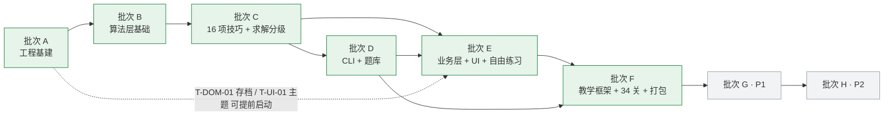

# 数独教学跨端游戏 · 任务分解 v1.0

> 编制：高见远（架构师）｜日期：2026-08-05
> 配套文档：doc 05《PRD 需求基线 v1.0》、doc 06《系统架构设计 v1.0》
> 使用者：寇豆码（工程师）—— **按批次逐批领取执行**；QA 按 §5 门禁验收
> 状态：**执行基线**。任务依赖无环，顺序即实现顺序。

---

## 0. 阅读与执行说明

| 项 | 说明 |
|---|---|
| 任务 ID 格式 | `T-<模块>-<序号>`，模块 ∈ `INF`（工程基建）/ `CORE` / `TEC`（技巧识别器）/ `CLI` / `CNT`（内容与题库）/ `DOM`（业务层）/ `UI` / `EDU`（教学）/ `PKG`（打包）/ `QA` |
| 批次 | 共 **6 个可交付批次（A–F）** 覆盖 P0；批次 G/H 为 P1/P2 后续阶段。**一个批次 = 一次可演示可验收的交付** |
| 依赖 | 「前置」列列出必须先完成的任务 ID；**同批次内无依赖关系的任务可并行** |
| 交付物 | 直接对应 doc 06 §3 的文件清单相对路径 |
| 验收 | 可量化判据；QA 门禁项标注 ⛔（不通过即阻断合入） |
| 覆盖 | 批次 A–F 完整覆盖 PRD §3.1 全部 P0 条目（P0-M0-05、P0-ENG-\*、P0-TEC-\*、P0-CLI-\*、P0-EDU-\*、P0-LVL-\*、P0-PRA-\*、P0-STO-\*、P0-UI-\*、P0-PKG-\*、P0-QA-\*） |

### 0.1 批次总览

| 批次 | 名称 | 对应里程碑 | 任务数 | 关键交付 |
|---|---|---|---|---|
| **A** | 工程基建与三层骨架 | M0 | 3 | 三包结构 + 双端构建复验 + CI 分层门禁 |
| **B** | 算法层基础设施 | M1-1 | 6 | Board/候选/回溯/生成/撤销 + 技巧框架 |
| **C** | 16 项技巧识别器 + 求解与分级 | M1-2 | 12 | 全技巧 + 逐级求解器 + 难度分级 + 单测门槛 |
| **D** | Dart CLI 出题工具与题库 | M1-3 | 7 | CLI 全命令 + 五档题库 + 试炼池 + 标注集 |
| **E** | 业务层 + UI 基础 + 自由练习 | M2 | 12 | 存档/Isolate/对局/棋盘/输入/自由练习/设置 |
| **F** | 教学框架 + 34 关内容 + 打包 | M3（**P0 完成**） | 13 | 演示/实操/试炼/学习地图 + 34 关 JSON + 双端产物 |
| G | P1：第 4/5 章 + 错题本 + 百科 + 回放 + 多端源码适配 | M4 | 9 | 后续阶段 |
| H | P2：统计看板 + 成就徽章 | — | 2 | 另行立项 |
| | **P0 合计（A–F）** | | **53** | |

### 0.2 批次依赖图

---

## 1. 批次 A · 工程基建与三层骨架（M0）

> 目标：三包结构落地、双端构建复验通过、CI 分层门禁生效。**本批次不写业务代码。**

| ID | 模块 | 任务名 | 前置 | 交付物 | 验收标准 |
|---|---|---|---|---|---|
| **T-INF-01** | pkg | **仓库骨架与三层架构落地**（P0-M0-05） | — | `app/`（由 `flutter create` 产物重命名）、`packages/sudoku_core/{pubspec.yaml,analysis_options.yaml,lib/sudoku_core.dart}`、`packages/sudoku_cli/{pubspec.yaml,bin/sudoku_cli.dart}`、根 `analysis_options.yaml`、`tools/ci/`、`dataset/`、`.gitignore` | `dart pub get` 三包全绿；`app` 通过 `path:` 依赖成功 import `sudoku_core`；`sudoku_cli` 同；`sudoku_core/pubspec.yaml` **无 flutter 依赖** |
| **T-INF-02** | pkg | **双端构建复验与版本锁定**（P0-M0-02/03/04，风险 A-02/A-03） | T-INF-01 | `.fvmrc`、三份 `pubspec.lock`（入库）、`docs/版本基线.md`、`app/android/app/build.gradle.kts`（minSdk 26、abiFilters arm64-v8a+armeabi-v7a）、Windows `CMakeLists` 确认 | 重命名后 `flutter build windows` 产出可双击启动；`flutter build apk --debug` 产出可安装启动；`flutter doctor -v` 期望输出已记录；版本号三处一致 |
| **T-QA-01** | qa | **CI 分层约束 + 静态门禁**（P0-QA-04/07） ⛔ | T-INF-01 | `tools/ci/check_layering.dart`、`tools/ci/run_gates.ps1`、`analysis_options.yaml`（strict-casts / strict-raw-types） | 人为在 `sudoku_core` 插入 `import 'package:flutter/material.dart'` → 脚本退出码非 0；`dart analyze` + `flutter analyze` 零告警 |

**批次 A 出口条件**：三包可编译、双端产物可启动、CI 门禁可阻断违规提交。

---

## 2. 批次 B · 算法层基础设施（M1-1）

> 目标：`sudoku_core` 的盘面、校验、候选、求解、生成、撤销与技巧框架全部就绪，为 16 项识别器提供地基。

| ID | 模块 | 任务名 | 前置 | 交付物 | 验收标准 |
|---|---|---|---|---|---|
| **T-CORE-01** | core | **模型层**（P0-ENG-01） | T-INF-01 | `model/{coord,peers,candidate_set,cell,board,board_codec,unit,digit}.dart`、`util/{bit_ops,rng,fingerprint,result,core_error}.dart` | `Board` 全程携带 `givenMask`（C-11）；81 字符串双向编解码往返一致；`Peers.sees` 与暴力计算 100% 一致（穷举 81×81 断言）；单测覆盖 ≥95% |
| **T-CORE-02** | core | **校验 + 候选计算与增量同步**（P0-ENG-02/04） | T-CORE-01 | `engine/{validator,candidate_calculator}.dart` | 增量同步结果与 `recomputeAll` 在 10,000 次随机操作序列后逐格一致；冲突检测正反例齐全 |
| **T-CORE-03** | core | **回溯求解 + 唯一解校验 + 谜题生成**（P0-ENG-03/06） | T-CORE-01/02 | `engine/{backtracking_solver,uniqueness_checker,generator}.dart` | 已知 1,000 题求解 100% 正确；`countSolutions(stopAt:2)` 在多解盘面正确返回 2；**单次求解 PC 端 < 5ms（p95）**；`generatePuzzle` 产出 100% 唯一解；同 seed 结果可复现 |
| **T-CORE-04** | core | **Move + 撤销/重做栈**（P0-ENG-05） | T-CORE-02 | `engine/{move,move_applier,undo_stack}.dart` | 覆盖填数/清除/候选标记/候选删除/整盘自动笔记五类；自动笔记整次操作为一个原子节点且可精确撤销/重做；深度 100 上限生效；随机 1,000 步「操作→全撤销」后盘面与初始态逐字段相等；重置本局正确 |
| **T-CORE-05** | core | **可视化数据 + 文案模板 + 技巧框架**（P0-ENG-09/10/11） | T-CORE-02 | `visual/{mark_role,shape_code,cell_mark,region_mark,link_mark,candidate_mark,visual_hint}.dart`、`narrative/{narration_params,narration_template,zh_cn_templates}.dart`、`techniques/{technique,technique_id,technique_rank,technique_result,solve_context,technique_registry,rule_set}.dart` | `TechniqueId` 恰 16 项且中文译名与 doc 03 §1 逐字一致；`rank` 表与 doc 06 §6.2 一致；`VisualHint` JSON 往返一致；`RuleSet.t1()/t2()` 元素数分别为 13/16 |
| **T-CORE-06** | core | **SanityGuard 安全断言**（P0-QA-03 底座） | T-CORE-03/05 | `engine/sanity_guard.dart` | 构造"删数命中终局解"的伪结果 → 抛 `E_TECH_001`；生产路径下断言开销 < 5% |

**批次 B 出口条件**：`dart test packages/sudoku_core` 全绿，行覆盖 ≥90%；无任何 flutter/dart:io 引用。

---

## 3. 批次 C · 16 项技巧识别器 + 求解与分级（M1-2）

> 目标：T1 13 项 + T2 3 项识别器全部交付，逐级求解器与难度分级器打通，**精确率 100% / 召回 ≥95% 门槛达成**。
> **每项识别器交付 = 识别算法 + 删数/填数结论 + `VisualHint` + 文案模板 + 正例/反例单测**（PRD §3.1.3 抬头要求）。

| ID | 模块 | 任务名 | 前置 | 交付物 | 验收标准 |
|---|---|---|---|---|---|
| **T-TEC-01** | core | **唯一余数 + 隐性唯一数**（P0-TEC-01/02） | T-CORE-05 | `techniques/basic/{naked_single,hidden_single}.dart` | 隐性唯一数**行/列/宫三单元均覆盖**；正反例各 ≥20；产出 `Placement` + 单元描边可视化 |
| **T-TEC-02** | core | **裸对/裸三 + 隐对/隐三（子集 N 泛化）**（P0-TEC-03/04/05/06） | T-CORE-05 | `techniques/basic/{naked_subset,hidden_subset}.dart` | 同一实现类以 `size` 参数支持 N=2/3；四项各正反例 ≥20；隐三不误报为隐对（更简单技巧优先由 rank 保证） |
| **T-TEC-03** | core | **区块排除（指针法 + 占位法）**（P0-TEC-07） | T-CORE-05 | `techniques/basic/locked_candidates.dart` | **两种情形都实现**且 `narration.slots.mode` 可区分；正反例各 ≥20 |
| **T-TEC-04** | core | **Fish(N) 泛化框架 + X 翼 + 剑鱼**（P0-TEC-08/09、P0-ENG-11） | T-CORE-05 | `techniques/fish/{fish_base,x_wing,swordfish}.dart` | X 翼行列对偶均支持；剑鱼**仅标准 N=3**；**退化为 X 翼时不上报**（专项反例测试）；正反例各 ≥20 |
| **T-TEC-05** | core | **鳍形 X 翼（含 Sashimi）**（P0-TEC-14） | T-TEC-04 | `techniques/fish/finned_x_wing.dart` | **鳍数上限 1**、**鳍须同宫**、**含 Sashimi 退化形态**；跨宫鳍/多鳍必须**不上报**（专项反例）；正反例各 ≥20 |
| **T-TEC-06** | core | **XY 翼 + XYZ 翼**（P0-TEC-10/11） | T-CORE-05 | `techniques/wing/{xy_wing,xyz_wing}.dart` | XYZ 翼删数格**须同时看到 pivot 与两 pincer**（专项反例：只看到两 pincer 不成立）；正反例各 ≥20 |
| **T-TEC-07** | core | **W 翼**（P0-TEC-15） | T-CORE-05 | `techniques/wing/w_wing.dart` | **严格共轭对强链**（单元内 b 恰 2 候选位）；分组强链/ALS 情形必须**不上报**（专项反例）；正反例各 ≥20 |
| **T-TEC-08** | core | **唯一矩形 型一/型二**（P0-TEC-12/13，风险 A-07） | T-CORE-05 | `techniques/uniqueness/{ur_base,ur_type1,ur_type2}.dart` | 四格须 **2 行×2 列×恰好 2 宫 + 全为非给定格**；`ctx.uniqueSolutionGuaranteed==false` 时**整族返回空**（专项反例）；含给定格的矩形必须不上报；正反例各 ≥20 |
| **T-TEC-09** | core | **简单涂色（共轭对图 + Rule2/Rule4）**（P0-TEC-16） | T-CORE-05 | `techniques/colouring/{conjugate_pair_graph,simple_colouring}.dart` | **仅 Rule 2 + Rule 4**；Multi-Colouring 情形不上报；链上连线 `strong/weak` 标记正确；正反例各 ≥20 |
| **T-CORE-07** | core | **逐级技巧求解器 + 提示扫描**（P0-ENG-07） | T-TEC-01…09 | `solver/{solve_step,solve_report,logical_solver,hint_scanner}.dart` | 按 rank 升序命中即返（"报更简单技巧优先"）；对 1,000 道 T2 内可解题 100% 解出；`SolveReport.histogram` 与逐步记录一致；每步经 `SanityGuard` |
| **T-CORE-08** | core | **难度分级器**（P0-ENG-08、C-15） | T-CORE-07 | `grading/{difficulty,difficulty_grader,technique_rank 补全}.dart` | 五档映射与 PRD §6.1 逐项一致；同一题多次评级结果稳定（确定性） |
| **T-CORE-09** | core | **题库/关卡模型与 JSON codec + 脚本回放器**（P0-EDU-01 底座、P0-LVL-07） | T-CORE-07 | `puzzle/{puzzle,puzzle_codec,solution_script,level_model,level_codec,level_index}.dart`、`solver/script_replayer.dart` | 关卡 JSON schema 与 doc 06 §4.3 一致；编解码往返一致；`ScriptReplayer` 对人造脚本能检出任意一步的不一致 |

**批次 C 出口条件 ⛔**
- `sudoku_core` 行覆盖率 **≥90%**；
- 每项技巧**正例 ≥20 + 反例 ≥20**（16 项 ≥ 640 条断言，其中标注盘面 ≥320 例由批次 D 的 T-QA-03 补足）；
- 全部 16 项 `TechniqueId` 均可被 `TechniqueRegistry.defaults()` 解析。

---

## 4. 批次 D · Dart CLI 出题工具与题库（M1-3）

> 目标：离线出题链路打通，五档题库 + 试炼池 + 教学候选盘面 + 标注集全部产出，质量指标达标。

| ID | 模块 | 任务名 | 前置 | 交付物 | 验收标准 |
|---|---|---|---|---|---|
| **T-CLI-01** | cli | **CLI 骨架 + 规则集 profile**（P0-CLI-01/02） | T-CORE-08 | `bin/sudoku_cli.dart`、`lib/src/commands/command_base.dart`、`lib/src/config/{cli_config,default_profiles}.dart`、`profiles/{t1.yaml,t2.yaml}` | **直接 import `sudoku_core`，零重复实现**（代码评审确认）；`--profile t2.yaml` 能声明式启用规则集；`--help` 完整 |
| **T-CLI-02** | cli | **生成/标注/筛选/去重管线**（P0-CLI-03，风险 A-06） | T-CLI-01 | `lib/src/commands/{generate,annotate,filter}_command.dart`、`lib/src/pipeline/{generation_pipeline,filter_spec,dedup}.dart`、`lib/src/io/progress_reporter.dart` | 支持 `--concurrency`；同 seed 结果可复现；去重后无同构重复；**产出实测命中率报表并回报架构师**（大师/困难档尤其关注） |
| **T-CLI-03** | cli | **导出命令 + 压缩落盘**（P0-CLI-04） | T-CLI-02, T-CORE-09 | `lib/src/commands/{export_bank,export_pool,export_level,verify}_command.dart`、`lib/src/io/json_writer.dart` | 导出格式与关卡/题库 schema 完全对齐；`verify` 能回放校验并输出不一致清单；GZip 原子落盘 |
| **T-CNT-01** | content | **自由练习题库产出**（P0-CLI-05） | T-CLI-03 | `app/assets/puzzles/{beginner,easy,medium,hard,master}.json.gz` | 每档 **200–500 题**；五档合计**压缩后 ≤1MB**；难度直方图与标注一致；App 侧解压 + 首题加载 <300ms |
| **T-CNT-02** | content | **综合试炼关题池产出**（P0-CLI-06） | T-CLI-03 | `app/assets/pools/{ch1,ch2,ch3}.json.gz`（第 0 章末关兼作验收，用 ch0 池） | 每章 **≥20 题**且**必含本章目标技巧**；抽取无重复 |
| **T-CNT-03** | content | **教学关候选盘面产出**（P0-CLI-07） | T-CLI-03 | `dataset/level_candidates/ch{0..3}/*.json` + 技巧验证报告 | 每关至少 5 个候选供人工精选；每个候选附完整解题脚本 |
| **T-QA-02** | qa | **标注盘面集 + 精确率/召回率评测**（P0-QA-02/06） ⛔ | T-CLI-02 | `dataset/annotated/<technique>/{positive,negative}/*.json`、`sudoku_cli verify --dataset` | **每技巧 ≥20 例，16 项合计 ≥320 例**，CLI 批量产出 + 人工核验；**Precision = 100%（零容忍）**、**Recall ≥95%** |
| **T-QA-03** | qa | **健全性模糊测试**（P0-QA-03） ⛔ | T-CORE-07 | `packages/sudoku_core/test/fuzz/sanity_fuzz_test.dart` | **10,000 道**随机唯一解谜题跑全部 16 项技巧，断言**任何删数都不等于该格终局解**；零失败；CI 可用 1,000 局快速模式 |

**批次 D 出口条件 ⛔**：Precision 100% / Recall ≥95% / 模糊测试零失败 / 题库体积达标。

---

## 5. 批次 E · 业务层 + UI 基础 + 自由练习（M2）

> 目标：存档、Isolate 调度、对局状态机、棋盘与输入、自由练习全链路、设置页交付。**本批次结束后 App 已可作为一款普通数独 App 使用。**

| ID | 模块 | 任务名 | 前置 | 交付物 | 验收标准 |
|---|---|---|---|---|---|
| **T-DOM-01** | domain | **存储层：原子写 + 迁移 + 备份 + 导入导出 + 崩溃日志**（P0-STO-01~08） | T-INF-01 | `domain/storage/**`（`progress_repository`、`json_progress_repository`、`atomic_file`、`storage_paths`、`schema_migration`、`backup_service`、`import_export_service`、`crash_log_service`、`models/*`） | **零数据库依赖**；写入走 tmp→rename；进程中途 kill 后存档不损坏（注入测试）；`schemaVersion` 迁移链可从 v1 升到当前并自动备份；导出/导入往返一致；崩溃日志保留最近 20 条；`deviceId/userId?/profileId?` 字段已预留 |
| **T-DOM-02** | domain | **Isolate 引擎服务 + EngineFacade + 加载闸门**（P0-ENG-12） | T-CORE-08 | `domain/engine/{engine_facade,engine_task,isolate_engine_service,loading_gate,engine_providers}.dart` | 评级/生成/提示扫描均在独立 Isolate；消息为纯数据（禁闭包）；**>300ms 自动上抛 loading**；`cancelAll` 后过期结果被丢弃；低端安卓连续 20 次扫描不掉帧（profile 模式验证） |
| **T-UI-01** | ui | **设计系统与主题令牌**（P0-UI-01/03/07、C-16） | T-INF-01 | `ui/theme/{app_theme,color_tokens,teaching_palette,typography,spacing,text_scale_clamp}.dart`、`ui/widgets/responsive_shell.dart` | Material 3 单一种子色；**白/粉/蓝三插槽存在，仅白色实现，另两套置灰**；**不做深色模式**；`MarkRole` → 颜色+形状映射与 doc 06 §6.4 逐行一致；系统字号钳制 0.85–1.3；居中限宽 + 最小窗口 900×640 等比缩放 |
| **T-UI-02** | ui | **棋盘组件（CustomPaint）**（P0-UI-02） | T-UI-01, T-CORE-01 | `ui/board/{board_geometry,board_view_model,board_painter,sudoku_board_view}.dart`、`ui/board/animations/error_shake.dart` | 暖白 + 绿色低饱和棋盘；深绿当前格、青绿相同数字、浅绿同行/列/宫；圆角外框与三层绿色灰阶格线；错误标红只描边不填底；候选数 3×3 微排布；golden 测试通过 |
| **T-UI-03** | ui | **输入层：移动键盘 + 桌面快捷键 + 功能条**（P0-UI-04/05、P0-PRA-02） | T-UI-02 | `ui/input/{numpad_panel,desktop_shortcuts,action_bar,input_intents}.dart` | 移动端**锁定竖屏 + 常驻自绘 3×3 键盘（不弹系统键盘）**，含笔记模式键（主路径）+ 长按格子标记（辅助），已出现 9 次的数字置灰但仍可点；桌面端方向键/1-9/Shift+1-9/Del/Ctrl+Z/Ctrl+Y/N/H/Esc 全部生效 |
| **T-DOM-03** | domain | **题库仓库 + 选题 + 运行时生成 + 文本导入**（P0-PRA-01/10） | T-CNT-01, T-CORE-09, T-DOM-02 | `domain/puzzle_bank/{puzzle_bank_repository,puzzle_picker,runtime_generator_service,puzzle_import_service}.dart` | 五档选题正确；**困难/大师档只用预置题库**；入门/简单/中等可 Isolate 内补充生成；81 字符串 + 剪贴板导入含格式校验与**唯一解校验**（失败返回 `E_IMPORT_001/002`）；**不做 OCR** |
| **T-DOM-04** | domain | **对局状态机 + 玩法规则 + 计时 + 断点续玩**（P0-PRA-02/03/05/06/07/08/09） | T-CORE-04, T-DOM-01, T-DOM-02 | `domain/session/{game_session,game_session_controller,session_rules,check_answer_service,timer_service,session_serializer,session_providers}.dart` | 撤销/重做/重置本局正确；**自动候选数与手动笔记互斥**且切换时弹窗提示清空；核对答案**只标错不纠正不透露空格**且计入统计；计时仅自由练习、失焦/锁屏自动暂停、手动暂停遮挡盘面；**退出自动保存盘面/笔记/用时/撤销栈**，重进可续玩，**不支持多局并存**，新局二次确认覆盖 |
| **T-DOM-05** | domain | **提示服务（分级、逐级解锁、配额）**（P0-PRA-04 / P0-EDU-04 底座） | T-DOM-02 | `domain/hint/{hint_level,hint_service,hint_state}.dart` | 自由练习两级、教学三级；**必须逐级解锁不可跳级**；**任何级别都不告知某格填几**（专项测试断言无 `Placement` 直出）；配额 `关闭/3/5/不限`，默认不限 |
| **T-UI-04** | ui | **难度选择页 + 自由练习页**（S-06/S-07、P0-PRA-\*） | T-DOM-03/04/05, T-UI-03 | `ui/features/free_play/{difficulty_page,free_play_page,pause_overlay,import_dialog,resume_banner}.dart`、`ui/widgets/loading_indicator.dart` | 五档卡片附"最高需用到 XX 技巧"说明；断点提示条正确；功能条齐全；提示两级 UI 与 `HintService` 一致；加载指示 >300ms 出现 |
| **T-UI-05** | ui | **设置页 + 数据管理 + 开发者模式**（P0-STO-06/07/08、P0-EDU-10、S-08/S-12） | T-DOM-01, T-UI-01 | `ui/features/settings/{settings_page,data_section,about_section}.dart`、`ui/features/developer/developer_page.dart`、`domain/settings/{settings_controller,developer_mode}.dart` | 设置项与 PRD P0-STO-08 **冻结清单逐项一致**（粉/蓝应用主题置灰、简体中文/English 可切换、无深色模式项）；重置全部进度二次确认；导出/导入存档桌面走 `file_selector`、移动走 `share_plus`；**连点版本号 7 次**进开发者模式（全解锁/重置/跳关/查看关卡元信息） |
| **T-DOM-06** | domain | **统计采集接入**（P0-STO-03、P2 预留） | T-DOM-01, T-DOM-04 | `domain/stats/stats_collector.dart` | 局数/用时/提示次数/错误次数/完成率**真实写入存档**，P0 不展示 UI |
| **T-UI-06** | ui | **音效与震动封装**（P0-UI-09） | T-UI-01 | `ui/widgets/sound_service.dart` | 3–5 个 CC0 素材 <300KB，**默认关闭**；不支持平台自动 no-op（风险 A-05）；震动走内置 `HapticFeedback`，移动端默认开 |
| **T-QA-04** | qa | **domain/UI 测试与端到端冒烟**（P0-QA-07） | T-UI-04, T-UI-05 | `app/test/unit/**`、`app/test/widget/**`、`app/test/golden/**`、`app/integration_test/smoke_test.dart` | domain 关键服务单测齐全；棋盘 golden 通过；冒烟脚本走完「启动 → 自由练习 → 填数 → 提示 → 退出 → 续玩」；`flutter analyze` 零告警 |

**批次 E 出口条件**：Windows 与 Android 均可完成一局完整自由练习并断点续玩；设置项全生效；无掉帧。

---

## 6. 批次 F · 教学框架 + 34 关内容 + 打包（M3，**P0 完成**）

> 目标：三段式教学关全部打通，第 0~3 章 34 关内容上线，双端产物交付。

| ID | 模块 | 任务名 | 前置 | 交付物 | 验收标准 |
|---|---|---|---|---|---|
| **T-EDU-01** | domain | **课程数据管线 + 解锁与三态**（P0-EDU-01/08/09、C-25） | T-CORE-09, T-DOM-01 | `domain/curriculum/{curriculum_repository,chapter_model,unlock_service,level_completion_service,curriculum_providers}.dart`、`app/assets/curriculum/index.json` | **新增一关 = 加文件 + 登记一行，零逻辑代码改动**（用一个测试关验证）；解锁规则 = 完成本章全部关卡才开下一章；三态正确；`stars/hintUsed/errorCount/durationMs` **从 P0 起真实采集** |
| **T-UI-07** | ui | **教学图层渲染 + 三类动效**（P0-EDU-03、P0-UI-03/09） | T-UI-02, T-CORE-05 | `ui/board/teaching_overlay_painter.dart`、`ui/board/animations/{highlight_fade,link_grow,candidate_strike}.dart` | **全部坐标来自 `VisualHint`，UI 零推断**（代码评审 + 测试断言）；多色高亮 150–250ms 渐变、虚线矩形可流动、连线生长 200–400ms 缓动、候选划除；**颜色+形状双通道**；golden 测试覆盖 Fish/Wing/UR/涂色四类形态 |
| **T-EDU-02** | domain+ui | **原理演示关控制器 + 演示页**（P0-EDU-02、S-03） | T-EDU-01, T-UI-07 | `domain/teaching/demo_controller.dart`、`ui/features/demo/{demo_page,technique_progress_bar,step_control_bar,narration_card}.dart` | 盘面**只读不可填数**；默认手动「下一步」，另有自动播放、上一步、重播；技巧进度条按脚本位置标出各技巧首次出现节点，点击可快速跳转；首次进入须完整看完，之后可跳过 |
| **T-EDU-03** | domain+ui | **引导实操关控制器 + 三级提示面板**（P0-EDU-04、S-04） | T-EDU-01, T-DOM-05, T-UI-03 | `domain/teaching/practice_controller.dart`、`ui/features/practice_level/{practice_level_page,hint_panel}.dart` | 玩家可自由填数/标记；**三级提示必须逐级解锁**（一级=指出可用 XX 技巧并高亮区域；二级=点明关键格；三级=给出删数结论）；**次数不限、不扣分、不消耗资源**；已用级别保留可回看 |
| **T-EDU-04** | domain+ui | **误操作即时纠正**（P0-EDU-05） | T-EDU-03 | `domain/teaching/{mistake_detector,mistake_message_repository}.dart`、`ui/features/practice_level/mistake_dialog.dart`、`app/assets/text/mistakes_zh.json` | **三类触发全覆盖**：(a) 填入与终局解不符；(b) 删除终局解中为真的候选；(c) 目标技巧触发态下用非目标手段抢先填数；弹窗含"错在哪 + 正确思路"两段、**不给答案**、单按钮；**同一关同一错误 2 分钟内不重复弹**；文案 **20–30 条** |
| **T-EDU-05** | domain+ui | **验收试炼关控制器 + 结算**（P0-EDU-06/07、S-05、C-06） | T-EDU-01, T-UI-03, T-CNT-02 | `domain/teaching/trial_controller.dart`、`ui/features/trial/{trial_page,result_sheet}.dart` | **提示按钮置灰**并带说明；**系统不校验玩家是否使用了目标技巧**，通关 = 完整解出整盘（专项测试：用其它技巧解完也判通过）；顶部标明"本关需用到：XX 技巧"；**不限次数、不重置整关**；**连续失败 3 次**弹出「回看本技巧原理演示」入口；结算卡显示用时/错误次数 |
| **T-EDU-06** | ui | **学习地图主页**（S-02） | T-EDU-01 | `ui/features/home/{home_page,chapter_card,level_grid}.dart`、`ui/widgets/technique_chip.dart` | 全部章节与关卡自由选择、无锁态；每个小关信息卡显示章内序号、主技巧、完整类型与完成星数；「自由练习」入口常驻；P1 入口位预留 |
| **T-UI-08** | ui | **首次启动引导**（P0-UI-08、S-01） | T-UI-01, T-EDU-06 | `ui/features/onboarding/onboarding_page.dart`、`app/lib/app/router.dart` 重定向 | 3 页横滑（产品定位/教学体系/自由练习）+ 页码点 + 跳过；**完成后直达第 0 章第 1 关**；`onboardingDone` 落盘后不再出现 |
| **T-CNT-04** | content | **第 0 章内容（10 关）**（P0-LVL-01/05/07、C-19） | T-CNT-03, T-EDU-01 | `app/assets/curriculum/ch0_l01..l10.json` + 文案 | 规则讲解 2（纯演示）+ 唯一余数/隐性唯一数 2 + 裸对 2（演示1+实操1）+ 隐对 2 + 区块排除 2；**末关兼作验收，不设独立综合试炼**；演示/实操关为**人工精选固定盘面**，每关附技巧验证报告 |
| **T-CNT-05** | content | **第 1~3 章内容（24 关）**（P0-LVL-02/03/04/05/06/07） | T-CNT-03, T-CNT-02, T-EDU-01 | `app/assets/curriculum/ch1_l01..l07.json`、`ch2_l01..l07.json`、`ch3_l01..l10.json` + 文案 | 第 1 章 2 演示+4 实操+1 试炼（裸三/隐三/X 翼）；第 2 章 2+4+1（鳍形 X 翼含 Sashimi/剑鱼）；第 3 章 3+6+1（XY 翼/XYZ 翼）；**试炼关盘面从题池抽取**（`poolRef`）；每关 JSON 含题面/given 掩码/完整解题脚本/技巧标签/章节归属 |
| **T-CNT-06** | content | **教学文案生产与校订**（P0-EDU-11、C-17） | T-CNT-04, T-CNT-05 | 34 关 JSON 内的 `title/intro/narration`、`mistakes_zh.json`、`lib/l10n/app_zh.arb` | AI 初稿 + 人工校订；**仅简体中文**；覆盖原理讲解、分步旁白、三级提示、错误纠正；ARB 结构就位但不做翻译；术语与 doc 03 §1 **定死译名**逐字一致 |
| **T-QA-05** | qa | **关卡 JSON 回放校验测试**（P0-QA-05、C-25） ⛔ | T-CNT-04/05, T-CORE-09 | `app/tool/ci/verify_levels_test.dart` | 遍历 `assets/curriculum/*.json`，用引擎回放预置脚本，**逐步校验技巧识别与删数与标注一致**；任意一步不一致即失败；试炼关校验"盘面确实含目标技巧" |
| **T-PKG-01** | pkg | **打包交付：Windows + Android + 占位资产**（P0-PKG-01~04，风险 A-04） | 全部 UI/EDU 任务 | `installer/sudoku_tutor.iss`（Inno Setup）、`scripts/build_release.ps1`、`app/assets/images/icon_placeholder.png`、`docs/替换品牌资产说明.md` | Windows：Release 目录 + **绿色版 zip（优先）** + `Setup.exe`；Android：`flutter build apk --debug`，**arm64-v8a + armeabi-v7a**；平台下限 Win10 1809 x64 / API 26；图标与启动图占位就位并写明替换方法；SmartScreen 提示已在文档说明 |

**批次 F 出口条件（= P0 完成）⛔**
- 34 关全部可玩通关，三段式教学链路完整；
- 全部 CI 门禁（§7 表）通过；
- Windows 与 Android 产物均可安装启动并走完「引导 → 第 0 章 → 第 3 章试炼 → 自由练习」全流程。

---

## 7. 批次 G · P1 后续阶段（M4）

> **后续阶段**，不阻塞 P0 交付。引擎侧 UR / 简单涂色在批次 C 已就绪，本批次为内容与功能补齐。

| ID | 模块 | 任务名 | 前置 | 交付物 | 验收标准 |
|---|---|---|---|---|---|
| T-CNT-07 | content | 第 4 章 · 唯一矩形 7 关（P1-LVL-01） | 批次 F | `assets/curriculum/ch4_l01..l07.json`、`assets/pools/ch4.json.gz` | 2 演示 + 4 实操 + 1 试炼；回放校验通过 |
| T-CNT-08 | content | 第 5 章 · 涂色技巧 7 关（P1-LVL-02） | 批次 F | `assets/curriculum/ch5_l01..l07.json`、`assets/pools/ch5.json.gz` | 2 演示 + 4 实操 + 1 试炼；**仅简单涂色，不含 AIC** |
| T-WRG-01 | domain | 错题本收录/移出/容量（P1-WRG-01/02/03） | 批次 F | `domain/mistake_book/**` | 触发条件为**可调常量**（同关 ≥2 次纠正 或 试炼失败 ≥1 次）；重玩**原关卡原盘面**、不生成相似题；一次性无提示无误操作通关自动移出；上限 100 条淘汰最旧 |
| T-WRG-02 | ui | 错题本列表页（P1-WRG-04、S-09） | T-WRG-01 | `ui/features/mistake_book/**` | 按技巧/章节筛选、滑动删除、一键清空、进入重练走无提示模式 |
| T-WIKI-01 | ui | 技巧百科 16 词条 + 静态图解（P1-WIKI-01/03、S-10） | 批次 F | `ui/features/wiki/**`、`assets/text/wiki_zh.json` | 16 项按难度档分组；含定义/图解（静态 CustomPaint）/适用时机/删数结论/常见误区；教学关与提示内技巧名可点击跳转 |
| T-WIKI-02 | ui | **W 翼词条强化**（P1-WIKI-02、C-08） | T-WIKI-01 | `assets/text/wiki_zh.json` 中 `wWing` 条目 + 提示内图文 | W 翼**无教学关**，本条为其唯一学习入口，图解须更详尽（含共轭对强链示意） |
| T-RPL-01 | domain+ui | 步骤回放（P1-RPL-01/02、S-11） | 批次 F | `domain/teaching/replay_recorder.dart` 消费端、`ui/features/replay/**` | **仅教学关**记录；每关最近 1 局、全局上限 60 局；仅存操作序列 + 技巧标注（单局 2–8KB）；播放器复用教学图层 |
| T-PKG-02 | pkg | macOS / iOS 源码适配（P1-PKG-01/02） | 批次 F | `app/macos/`、`app/ios/`、`docs/macOS-iOS构建说明.md` | `--platforms` 可扩展；**不使用平台特有 API**；布局响应式；**本期不出产物**，仅交源码 + 构建说明 |
| T-QA-06 | qa | P1 回归与门禁复跑 | 上述全部 | — | 全部 §7 门禁复跑通过；新增章节回放校验通过 |

---

## 8. 批次 H · P2（另行立项）

| ID | 模块 | 任务名 | 说明 |
|---|---|---|---|
| T-STAT-01 | ui | 练习数据统计看板（P2-STAT-01） | 原始数据 P0 起已采集（T-DOM-06），仅缺展示 UI |
| T-ACH-01 | domain+ui | 成就徽章与星级（P2-ACH-01/02） | 字段 `stars/hintUsed/errorCount/durationMs` P0 起已真实采集 |

> ~~每日一题~~ / ~~排行榜~~：**已 deferred**，与"完全离线"红线冲突，本期不预留账号体系与网络层。

---

## 9. PRD P0 条目覆盖对照表（自检）

| PRD 条目 | 覆盖任务 |
|---|---|
| P0-M0-01~04 | 客户侧（doc 04）+ T-INF-02 |
| P0-M0-05 | T-INF-01、T-QA-01 |
| P0-ENG-01/02/03/04/05/06 | T-CORE-01/02/03/04 |
| P0-ENG-07/08 | T-CORE-07/08 |
| P0-ENG-09/10/11 | T-CORE-05、T-TEC-04（Fish 框架） |
| P0-ENG-12 | T-DOM-02 |
| P0-TEC-01~13（T1） | T-TEC-01/02/03/04/06/08 |
| P0-TEC-14/15/16（T2） | T-TEC-05/07/09 |
| P0-CLI-01~07 | T-CLI-01/02/03、T-CNT-01/02/03 |
| P0-EDU-01/08/09 | T-EDU-01 |
| P0-EDU-02/03 | T-EDU-02、T-UI-07 |
| P0-EDU-04/05 | T-EDU-03/04、T-DOM-05 |
| P0-EDU-06/07 | T-EDU-05 |
| P0-EDU-10 | T-UI-05 |
| P0-EDU-11 | T-CNT-06 |
| P0-LVL-01~07 | T-CNT-02/03/04/05 |
| P0-PRA-01~10 | T-DOM-03/04/05、T-UI-04 |
| P0-STO-01~08 | T-DOM-01、T-UI-05、T-DOM-06 |
| P0-UI-01~11 | T-UI-01/02/03/04/06/07/08、T-EDU-06 |
| P0-PKG-01~04 | T-PKG-01、T-INF-02 |
| P0-QA-01~07 | T-QA-01/02/03/04/05 + 各批次出口条件 |

---

> **本文为执行基线。** 任务顺序即实现顺序；批次内无依赖任务可并行。任何范围变更须以变更单形式追加。
